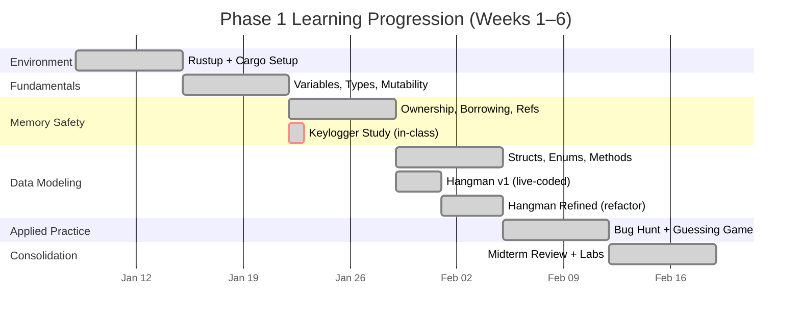
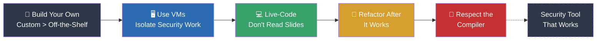
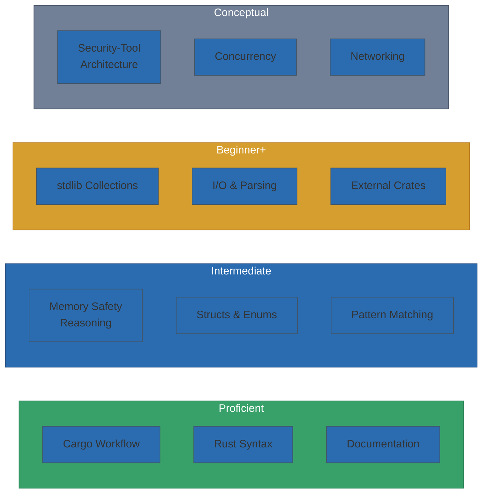
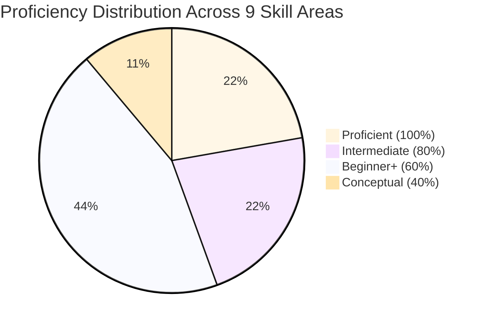

# Final Project — Tool Development Methodology & Phase 1 Portfolio

**Course:** CSEC Tool Development (CSC-7309) | **Term:** Winter 2025 | **Instructor:** Travis Czech

> [!NOTE]
> **Portfolio Scope:** This document covers **Phase 1** (Weeks 1–6, pre-midterm) of the CSEC Tool Development course. It presents the foundational Rust skills, security-tool methodology, and applied projects completed during the first half of the course. Phase 2 content (Weeks 7–12: network scanners, cryptography, advanced tool development) will extend this portfolio as materials become available.

---

## What Was Covered (Weeks 1–6)

### Learning Timeline

By the midterm, the course had built the full Rust foundation needed to author custom security tools:

- Environment mastery (Rustup, Cargo, VS Code)
- Language fundamentals (variables, types, mutability)
- Memory safety model (ownership, borrowing, references)
- Data modeling (structs, impls, methods, enums)
- One complete working program (Hangman, with refactor to idiomatic Rust)

## What the Course Was Building Toward

From the Week 1 and Week 2 lectures, the instructor previewed the trajectory:

| Tool Type | Rust Concepts Needed | When in Course |
|---|---|---|
| **Hangman game** (completed) | structs, enums, Vec, HashSet, match, rand | Week 4 |
| **Port scanner** (mentioned Week 2) | `std::net::TcpStream`, threading, error handling | Post-midterm |
| **Vulnerability scanner** (preview) | HTTP clients, parsers, concurrency | Post-midterm |
| **Simple keylogger** (study ref, Week 3) | OS-specific crates, raw input handling | Post-midterm |
| **Cryptographic tools** (preview, Week 4) | byte arrays, trait objects, `crypto` crates | Post-midterm |

## Methodology Observed

### Instructor Methodology Flow

Throughout the course the instructor reinforced a consistent methodology for security tool development:

### 1. Build Your Own, When You Can

> *"I personally like writing my own tools instead of using somebody else's. Makes life a little bit easier."* — Travis Czech, Week 1

Using custom tooling lets you:

- Understand exactly what the tool does (no surprises from third-party code)
- Adapt it to novel scenarios
- Learn systems concepts that make you a better defender

### 2. Use VMs for Security Work

> *"I recommend using either Linux or a virtualized version of Windows."* — Travis Czech, Week 1

Security tools can accidentally damage the host. Always develop in VMs that can be reverted from snapshot.

### 3. Live-Code, Don't Read Slides

The instructor's delivery was live-coded. This:

- Exposed real compiler errors and typical fixes
- Demonstrated iterative thinking
- Embedded the mental model of "write, compile, read the error, fix" into the students

### 4. Refactor After It Works

The v1 → refined Hangman pattern (see [MIDTERM_PROJECT_SUMMARY.md](MIDTERM_PROJECT_SUMMARY.md)) is the core methodology: get a working solution first, then refactor to idiomatic code once the problem is understood.

### 5. Respect the Compiler

> The borrow checker feels adversarial until you realize it's preventing exactly the bug classes (use-after-free, data races) that plague C and C++.

## Applied Exercises Summary

| Week | Exercise | Concepts Reinforced | Outcome | Evidence |
|---|---|---|---|---|
| 1 | Hello, World (cargo new) | Toolchain end-to-end | ✅ Compiled & ran | [Lab 1](assignments/Labs_1-3_Summary.md) |
| 2 | Variables & types walkthrough | Mutability, type inference | ✅ Demonstrated | [Lab 1](assignments/Labs_1-3_Summary.md) |
| 3 | In-class simple keylogger study | Ownership in practical code | ✅ Reviewed | [Keylogger Study](KEYLOGGER_STUDY_WEEK3.md) |
| 3 | Ownership & borrowing exercises | Move, borrow, mutable borrow | ✅ Completed | [Lab 2](assignments/Labs_1-3_Summary.md) |
| 4 | Hangman v1 (live-coded) | Structs, methods, Vec | ✅ Working | [Source](scripts/hangman_v1/src/main.rs) |
| 4 | Hangman refined (refactor) | Enums, HashSet, idiomatic Rust | ✅ Working + tested | [Source](scripts/hangman_refined/src/main.rs) |
| 5 | Bug Hunt (Assignment 1) | Compiler diagnostics, debugging | ✅ Completed | [Writeup](assignments/Assignment01_BugHunt.md) |
| 5 | Guessing Game (Rust Book ch. 2) | stdin, match, loop, parse | ✅ Completed | [Source](scripts/guessing_game/src/main.rs) |
| 6 | Practice midterm | Sections 1–5 synthesis | ✅ Completed | [Labs 1–3](assignments/Labs_1-3_Summary.md) |

## Skills Inventory — Validated to Week 6

| Skill Area | Level | Proficiency | Evidence |
|---|---|---|---|
| **Rust syntax** | Proficient | 100% | Hangman refined + Guessing Game + 24 unit tests |
| **Memory safety reasoning** | Intermediate | 80% | Ownership/borrowing labs + keylogger study |
| **Cargo workflow** | Proficient | 100% | 3 multi-crate projects with build automation |
| **Pattern matching** | Intermediate | 80% | `match` on enum, Result, Ordering |
| **stdlib collections** | Beginner+ | 60% | `Vec`, `HashSet` used correctly |
| **External crates** | Beginner+ | 60% | `rand`, `chrono`, `evdev` studied |
| **I/O & stdin parsing** | Beginner+ | 60% | Hangman + Guessing Game input loops |
| **Error handling** | Beginner+ | 60% | `.expect()`, `match Result`, `?` operator |
| **Security-tool architecture** | Conceptual | 40% | Keylogger study + scanner previews |

### Skill Acquisition Distribution

## Reflection

The first half of CSEC Tool Development succeeds because it treats Rust not as a language to memorize, but as a **design philosophy**. Ownership is the lens; every subsequent concept (borrowing, lifetimes, traits, concurrency) sits on that foundation.

Whether the course continued into network scanners, crypto tools, or malware analysis, the Week 1–6 foundation was designed to make those topics *tractable* rather than magical.

**Personal takeaway:** I now read Rust compiler errors as helpful feedback rather than gatekeeping. The v1 → refined Hangman exercise was the moment that clicked. Given a real security-tool problem today, I would reach for Rust without hesitation for anything that touches memory, threads, or a network socket.

### What Was Genuinely Hard

Not everything came naturally. Some honest struggles from Phase 1:

1. **The borrow checker felt adversarial in Week 3.** I spent 45 minutes on a single ownership error where I tried to store a reference (`&String`) and then move the original value. The compiler error (`E0505: cannot move out of value because it is borrowed`) was clear, but understanding *why* Rust forbids this required re-reading the three ownership rules multiple times. It was only after drawing out the stack/heap memory layout on paper that the "aha" moment arrived.

2. **`String` vs. `&str` confusion persisted for days.** In Lab 1, I tried `let name: &str = String::from("Ross")` and got a type mismatch. Coming from Python where strings are just strings, the distinction between owned heap-allocated `String` and borrowed slice `&str` felt like unnecessary complexity — until the keylogger study showed why ownership of string data matters for security tools that handle sensitive input.

3. **Variable shadowing felt wrong.** In the Guessing Game (Assignment 2), reusing `let guess` for both the `String` input and the parsed `u32` felt like it should be a redeclaration error. I had to actively unlearn assumptions from C and Python where this would be a bug, not a feature. I still instinctively reach for `guess_str` / `guess_num` naming.

4. **Lifetimes remain partially opaque.** Week 3 previewed lifetime annotations but we didn't write any in Phase 1. I understand conceptually that `'a` connects input and output reference scopes, but I haven't yet faced a compiler error that forced me to add lifetime annotations. This is my biggest gap going into Phase 2.

5. **Test-writing discipline was initially weak.** For Hangman v1, I wrote zero tests and considered the project "done" when it ran. The instructor's refactoring exercise forced me to add tests, and the process of writing `game_with_word()` test helpers taught me that testable code requires different architecture than "just make it work" code. The v1 → refined jump was partly about making the code testable, not just idiomatic.

### What I Would Do Differently

If I were starting Phase 1 again:

- **Write tests first** for every function before implementing — the refined Hangman tests caught edge cases I would have missed.
- **Draw memory diagrams** earlier — I should have been sketching stack/heap layouts from Week 2, not Week 3.
- **Embrace compiler errors immediately** rather than trying to suppress them with `.clone()` everywhere. Several of my early "fixes" were `.clone()` calls that hid real design problems.

## Time Investment & Effort

| Activity | Approximate Hours |
|---|---|
| Live lectures (6 weeks × ~3 hours) | ~18 hours |
| Lab work (assignments, debugging, experimentation) | ~12 hours |
| Hangman project (v1 + refined refactoring + tests) | ~6 hours |
| Portfolio authoring (synthesis, diagrams, documentation) | ~10 hours |
| **Total estimated effort** | **~46 hours** |

> [!NOTE]
> This is a solo portfolio. All code, documentation, and analysis was completed individually. Lectures were delivered live with instructor-led live-coding; all student-authored code was written independently during lab sessions and personal study time.

## Security Vulnerability Classes Addressed

The Rust skills demonstrated in this portfolio directly mitigate the following CWE vulnerability classes that plague C/C++ security tools:

| CWE ID | Vulnerability | How Rust Prevents It | Portfolio Evidence |
|---|---|---|---|
| [CWE-416](https://cwe.mitre.org/data/definitions/416.html) | Use After Free | Ownership model — values dropped exactly once | Week 3 ownership labs, keylogger `Arc<AtomicBool>` |
| [CWE-119](https://cwe.mitre.org/data/definitions/119.html) | Buffer Overflow | Bounds-checked array/slice access at runtime | Hangman `Vec<char>` iteration, `HashSet` lookups |
| [CWE-476](https://cwe.mitre.org/data/definitions/476.html) | Null Pointer Dereference | `Option<T>` replaces null pointers | `words.choose()` returns `Option<&&str>` |
| [CWE-362](https://cwe.mitre.org/data/definitions/362.html) | Race Condition | `&mut T` exclusivity + `Send`/`Sync` traits | Keylogger `Arc<AtomicBool>` signal handler |
| [CWE-200](https://cwe.mitre.org/data/definitions/200.html) | Information Exposure | Explicit error handling via `Result<T,E>` | Guessing game `match` on parse result |

## Phase 2 Roadmap

This portfolio is actively maintained. The following items represent planned extensions as additional course content becomes available:

| Phase | Content | Status |
|---|---|---|
| **Phase 1** (this portfolio) | Weeks 1–6: Rust fundamentals, ownership, structs, Hangman, keylogger study | ✅ Complete |
| **Phase 2a** | Weeks 7–9: Port scanner implementation, networking primitives | 🔜 Planned |
| **Phase 2b** | Weeks 10–11: Vulnerability scanner, cryptography modules | 🔜 Planned |
| **Phase 2c** | Week 12: Final project — integrated security tool | 🔜 Planned |

> [!TIP]
> **For hiring managers:** Phase 1 demonstrates the complete Rust foundation needed for security tool development. The skills validated here (ownership model, struct-based architecture, compiler-guided development, safe concurrency patterns) directly transfer to the advanced tools in Phase 2.

## Attribution

Course design, methodology, and all lecture content © Travis Czech / Cambrian College (CSC-7309, Winter 2025). This reflection is student-authored synthesis by Ross Moravec for portfolio purposes.
