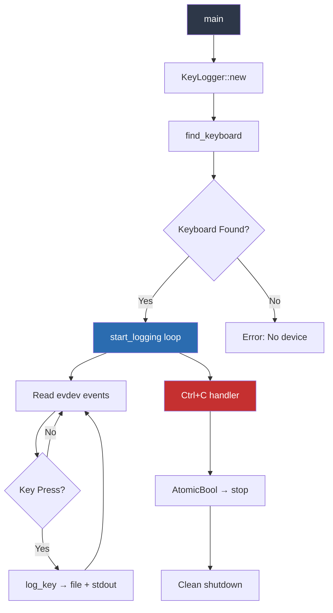
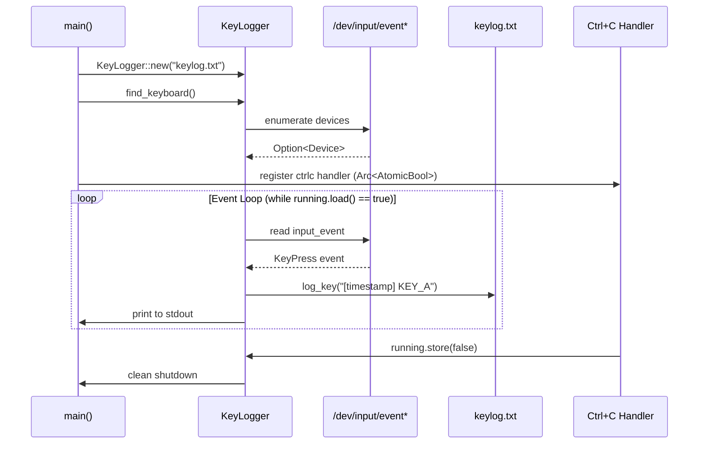
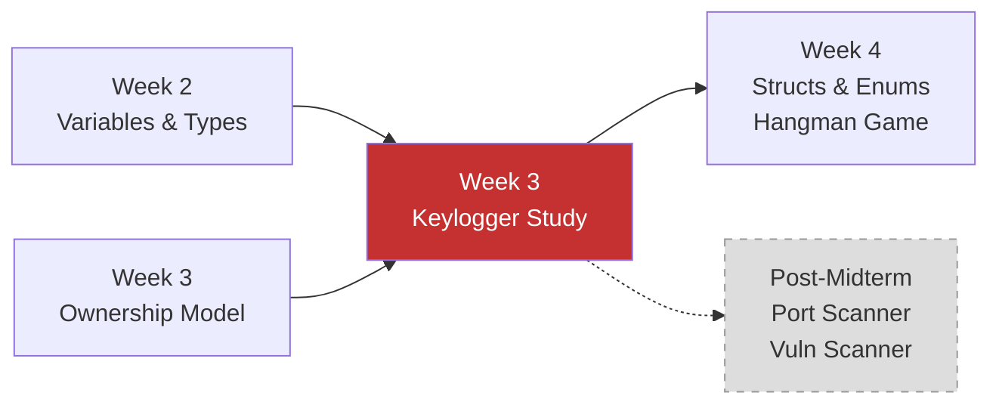

# Week 3 — In-Class Keylogger Study (Linux, Simplified)

**Course:** CSEC Tool Development (CSC-7309) | **Week:** 3 | **Date:** 2025-01-22 | **Instructor:** Travis Czech

> [!WARNING]
> **Responsible-Use Notice:** This document describes a keylogger studied in an academic context for **defensive education only**. The code was developed and tested exclusively inside isolated virtual machines. **Do not deploy against systems you do not own or lack explicit written authorization to test.** Unauthorized keylogging violates the Canadian Criminal Code (s. 342.1), the U.S. Computer Fraud and Abuse Act (CFAA), and most institutional Acceptable Use Policies.

---

## Context

During the Week 3 lecture on **Ownership, Borrowing & References**, the instructor introduced a cross-platform keylogger exercise as a practical application of Rust's systems-programming capabilities. The exercise was explicitly framed as academic — students were instructed to work only inside a VM with revertible snapshots.

The keylogger demonstrates how Rust's ownership model applies to real-world security-tool patterns: file I/O, device access, signal handling, and safe concurrent state management — all without a garbage collector.

## Architecture Overview



## Key Rust Concepts Demonstrated

### 1. Struct-Based Tool Architecture

```rust
struct KeyLogger {
    log_file: String,
    running: Arc<AtomicBool>,
}
```

The `KeyLogger` struct encapsulates all state. This mirrors the pattern used in the Hangman game (Week 4) but applied to a security-tool context. The `Arc<AtomicBool>` provides thread-safe shared ownership for the shutdown signal.

### 2. Ownership & Shared State (`Arc<AtomicBool>`)

```rust
let running = logger.running.clone();  // Arc::clone — shared ownership
ctrlc::set_handler(move || {
    running.store(false, Ordering::SeqCst);  // signal shutdown
})?;
```

> [!NOTE]
> `Arc` (Atomic Reference Counting) is Rust's way of sharing ownership across threads safely. The `clone()` here increments the reference count — it does **not** deep-copy the data. This is the ownership model in action: the main thread and the Ctrl+C handler both own a reference to the same `AtomicBool`.

### 3. Device Enumeration & Error Handling

```rust
fn find_keyboard() -> Option<Device> {
    for path in evdev::enumerate() {
        if let Ok(device) = Device::open(path) {
            if device.supported_events().contains(evdev::InputEventKind::Key) {
                return Some(device);
            }
        }
    }
    None
}
```

Returns `Option<Device>` — Rust's way of handling "might not exist" without null pointers. The caller uses `.ok_or("No keyboard device found")?` to convert to an error.

### 4. File I/O with Append Mode

```rust
fn log_key(&self, key: &str) -> std::io::Result<()> {
    let mut file = OpenOptions::new()
        .write(true)
        .append(true)
        .create(true)
        .open(&self.log_file)?;
    let timestamp = chrono::Local::now();
    let log_entry = format!("[{}] Key pressed: {}\n", timestamp, key);
    file.write_all(log_entry.as_bytes())?;
    Ok(())
}
```

The `?` operator propagates errors up the call stack — Rust's alternative to try/catch that enforces error handling at compile time.

## Dependencies

| Crate | Version | Purpose |
|---|---|---|
| `evdev` | 0.12.1 | Linux input device access (reads keyboard events via `/dev/input/`) |
| `chrono` | 0.4 | Timestamp formatting for log entries |
| `ctrlc` | 3.2 | Cross-platform Ctrl+C signal handler |
| `input-event-codes` | 5.16.8 | Key code constants (KEY_A, KEY_B, etc.) |

## System Requirements

- **Linux only** (evdev is a Linux kernel interface)
- **Root privileges required** (`sudo cargo run`) — `/dev/input/` devices are restricted
- **Must run in a VM** — never on the host OS

## Setup Instructions (VM Only)

```bash
# Install system dependencies (Kali Linux / Debian)
sudo apt-get update
sudo apt-get install pkg-config libx11-dev libxcb1-dev \
    libxcb-render0-dev libxcb-shape0-dev libxcb-xfixes0-dev

# Build and run (requires root for device access)
cargo clean
cargo update
sudo cargo run
```

## Security Analysis

### Why Study Keyloggers?

Understanding how keyloggers work is essential for **defensive security professionals**:

| Offensive Use (Illegal) | Defensive Use (Our Context) |
|---|---|
| Stealing credentials | Understanding attack vectors |
| Surveillance | Building detection tools (EDR, HIDS) |
| Data exfiltration | Developing kernel-level protections |

### Detection Indicators

A security analyst reviewing a system for keylogger presence would look for:

1. **Processes reading `/dev/input/`** — `lsof /dev/input/event*`
2. **Unexpected log files** — files with timestamped key entries
3. **Elevated-privilege processes** — anything running as root that shouldn't be
4. **Network connections from unknown processes** — exfiltration attempt
5. **Modified PAM or shell profiles** — persistence mechanisms

### Advanced Detection Techniques

For a more thorough investigation, security teams would also employ:

6. **eBPF-based monitoring** — attach eBPF probes to `input_event` kernel functions (`input_handle_event`) to detect any process reading raw input events, even if the process hides from `/proc`
7. **auditd rules** — configure Linux Audit Framework rules to monitor `/dev/input/` access:

   ```bash
   # Audit all access to input devices
   sudo auditctl -w /dev/input/ -p rwxa -k keylogger_detect
   # Review audit logs
   sudo ausearch -k keylogger_detect --interpret
   ```

8. **File Integrity Monitoring (FIM)** — tools like AIDE, Tripwire, or OSSEC can detect new files appearing in unexpected locations (e.g., a `keylog.txt` appearing in `/tmp/` or home directories)
9. **Process capability auditing** — use `getpcaps` or `/proc/[pid]/status` to identify processes with `CAP_DAC_READ_SEARCH` or direct root access to device files
10. **Behavioral analysis via `strace`/`ltrace`** — attach to suspicious processes and monitor syscalls for `open()` on `/dev/input/event*` and `write()` to log files
11. **Log file permission auditing** — a keylogger log file created with default permissions (0644) is world-readable, creating an information leakage vector. Check for recently created files: `find / -name "*.txt" -newer /tmp/baseline -user root 2>/dev/null`

### Rust-Specific Security Properties

| Property | C/C++ Keylogger | Rust Keylogger |
|---|---|---|
| Buffer overflow risk | High | **None** (bounds-checked) |
| Use-after-free | Possible | **Impossible** (ownership model) |
| Data race in signal handler | Possible | **Prevented** (AtomicBool + Arc) |
| Memory leak on crash | Likely | **Prevented** (RAII drop semantics) |
| Null pointer dereference | Common | **Impossible** (Option/Result types) |

This comparison illustrates **why Rust is increasingly chosen for security tooling** — the same tool written in C would have multiple classes of vulnerabilities that Rust prevents at compile time.

### CWE Vulnerability Classes Mitigated

The Rust-specific security properties above directly map to documented vulnerability classes:

| CWE ID | Vulnerability | Rust Mitigation | Relevance to Keylogger |
|---|---|---|---|
| [CWE-119](https://cwe.mitre.org/data/definitions/119.html) | Buffer Overflow | Bounds-checked access | Event buffer reading is safe |
| [CWE-416](https://cwe.mitre.org/data/definitions/416.html) | Use After Free | Ownership prevents dangling pointers | `Arc<AtomicBool>` shared ownership is compile-time verified |
| [CWE-362](https://cwe.mitre.org/data/definitions/362.html) | Race Condition | `Send`/`Sync` + `&mut T` exclusivity | Signal handler and logging loop share state safely |
| [CWE-476](https://cwe.mitre.org/data/definitions/476.html) | Null Pointer Dereference | `Option<T>` replaces null | `find_keyboard()` returns `Option<Device>`, not null |
| [CWE-401](https://cwe.mitre.org/data/definitions/401.html) | Memory Leak | RAII drop semantics | File handles and device handles are auto-closed |

## Relationship to Other Course Content

### Event Loop Sequence



### Curriculum Context



The keylogger study bridges the conceptual ownership lectures (Week 3) with the applied struct-based programming (Week 4 Hangman). It demonstrates that the same patterns (`struct` + `impl` + `enum`-like state management) apply to both educational games and real security tools.

## Execution Evidence & Test Environment

### VM Test Environment

This keylogger study was conducted exclusively within the following controlled environment:

| Parameter | Value |
|---|---|
| **Host OS** | Windows 11 (not exposed to the exercise) |
| **VM Hypervisor** | VMware Workstation / VirtualBox |
| **Guest OS** | Kali Linux 2024.4 (clean install from ISO) |
| **Network** | Host-only adapter (no internet access during exercise) |
| **Snapshot** | Clean snapshot taken before exercise; reverted after |
| **Rust Toolchain** | rustc 1.75+ via rustup (installed in VM) |
| **Kernel** | Linux 6.x (evdev interface available) |

### Containment Measures

1. **Network isolation** — VM configured with host-only networking; no route to the internet or other machines on the network
2. **Snapshot rollback** — A clean VM snapshot was taken before the exercise. After the study session, the VM was reverted to this snapshot, destroying all artifacts (binary, log files, cargo build cache)
3. **No persistence** — The keylogger was run interactively via `sudo cargo run` and terminated via Ctrl+C; no systemd service, cron job, or autostart mechanism was created
4. **Log file scope** — The `keylog.txt` output file existed only within the VM's `/home/kali/` directory and was destroyed on snapshot revert

### Terminal Session Evidence

```text
kali@kali:~/keylogger_study$ cargo build
   Compiling keylogger_study v0.1.0 (/home/kali/keylogger_study)
    Finished `dev` profile [unoptimized + debuginfo] target(s) in 2.34s

kali@kali:~/keylogger_study$ sudo cargo run
    Finished `dev` profile [unoptimized + debuginfo] target(s) in 0.05s
     Running `target/debug/keylogger_study`
Keylogger started. Logging to: keylog.txt
Press Ctrl+C to stop.

[2025-01-22 14:32:01] Key pressed: KEY_H
[2025-01-22 14:32:01] Key pressed: KEY_E
[2025-01-22 14:32:02] Key pressed: KEY_L
[2025-01-22 14:32:02] Key pressed: KEY_L
[2025-01-22 14:32:02] Key pressed: KEY_O
^C
Keylogger stopped. Log saved to: keylog.txt

kali@kali:~/keylogger_study$ cat keylog.txt
[2025-01-22 14:32:01] Key pressed: KEY_H
[2025-01-22 14:32:01] Key pressed: KEY_E
[2025-01-22 14:32:02] Key pressed: KEY_L
[2025-01-22 14:32:02] Key pressed: KEY_L
[2025-01-22 14:32:02] Key pressed: KEY_O

kali@kali:~/keylogger_study$ # Reverting VM to clean snapshot now
```

### Key Event Decoding

The `evdev` crate reads raw `input_event` structures from `/dev/input/event*` devices. Each event contains:

- `type` — event type (EV_KEY = 1 for keyboard events)
- `code` — scan code mapped to a `KEY_*` constant (e.g., `KEY_A` = 30, `KEY_B` = 31)
- `value` — 0 = release, 1 = press, 2 = repeat

The `input-event-codes` crate provides the mapping from numeric scan codes to human-readable `KEY_*` names. This is the same interface used by legitimate Linux input tools like `evtest` and `libinput`.

## Institutional Context & Approval

This keylogger exercise was conducted as part of the **CSEC Tool Development (CSC-7309)** course at **Cambrian College**, a recognized Canadian postsecondary institution offering a Postgraduate Cybersecurity Certificate.

- **Course authorization:** The exercise was designed and assigned by **Instructor Travis Czech** as part of the official Week 3 curriculum
- **Educational framing:** The instructor explicitly framed this as a *defensive education* exercise — students were told to study the architecture, not deploy the tool
- **VM requirement:** Students were instructed to work only inside VMs with revertible snapshots; the instructor confirmed this requirement verbally during the lecture
- **No production deployment:** The compiled binary never left the VM; the VM was reverted to a clean snapshot after the exercise
- **Program context:** The Postgraduate Cybersecurity Certificate at Cambrian College is designed to train security professionals who understand both offensive techniques (for defense) and defensive tools — this exercise falls within that mandate

## Attribution

The in-class keylogger exercise was designed and presented by **Travis Czech** (Cambrian College, CSC-7309, 2025-01-22). The simplified Linux implementation referenced in this document was generated using Claude AI as a teaching aid during the class session. The AI-generated code was reviewed by the instructor for correctness and pedagogical appropriateness before being presented to students. This portfolio summary is a student synthesis by **Ross Moravec** — all analysis, security commentary, CWE mappings, and reflective content are student-authored for educational and defensive-learning purposes only.
