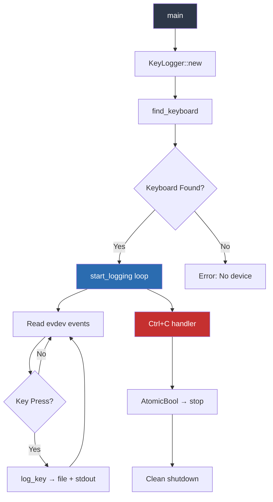
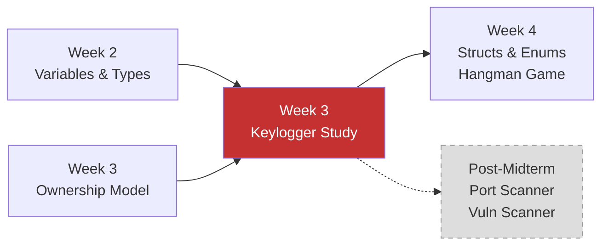

# Week 3 — In-Class Keylogger Study (Linux, Simplified)

**Course:** CSEC Tool Development (CSC-7309) | **Week:** 3 | **Date:** 2025-01-22 | **Instructor:** Travis Czech

> [!WARNING]
> **Responsible-Use Notice:** This document describes a keylogger studied in an academic context for **defensive education only**. The code was developed and tested exclusively inside isolated virtual machines. **Do not deploy against systems you do not own or lack explicit written authorization to test.** Unauthorized keylogging violates the Canadian Criminal Code (s. 342.1), the U.S. Computer Fraud and Abuse Act (CFAA), and most institutional Acceptable Use Policies.

---

## Context

During the Week 3 lecture on **Ownership, Borrowing & References**, the instructor introduced a cross-platform keylogger exercise as a practical application of Rust's systems-programming capabilities. The exercise was explicitly framed as academic — students were instructed to work only inside a VM with revertible snapshots.

The keylogger demonstrates how Rust's ownership model applies to real-world security-tool patterns: file I/O, device access, signal handling, and safe concurrent state management — all without a garbage collector.

## Architecture Overview



## Key Rust Concepts Demonstrated

### 1. Struct-Based Tool Architecture

```rust
struct KeyLogger {
    log_file: String,
    running: Arc<AtomicBool>,
}
```

The `KeyLogger` struct encapsulates all state. This mirrors the pattern used in the Hangman game (Week 4) but applied to a security-tool context. The `Arc<AtomicBool>` provides thread-safe shared ownership for the shutdown signal.

### 2. Ownership & Shared State (`Arc<AtomicBool>`)

```rust
let running = logger.running.clone();  // Arc::clone — shared ownership
ctrlc::set_handler(move || {
    running.store(false, Ordering::SeqCst);  // signal shutdown
})?;
```

> [!NOTE]
> `Arc` (Atomic Reference Counting) is Rust's way of sharing ownership across threads safely. The `clone()` here increments the reference count — it does **not** deep-copy the data. This is the ownership model in action: the main thread and the Ctrl+C handler both own a reference to the same `AtomicBool`.

### 3. Device Enumeration & Error Handling

```rust
fn find_keyboard() -> Option<Device> {
    for path in evdev::enumerate() {
        if let Ok(device) = Device::open(path) {
            if device.supported_events().contains(evdev::InputEventKind::Key) {
                return Some(device);
            }
        }
    }
    None
}
```

Returns `Option<Device>` — Rust's way of handling "might not exist" without null pointers. The caller uses `.ok_or("No keyboard device found")?` to convert to an error.

### 4. File I/O with Append Mode

```rust
fn log_key(&self, key: &str) -> std::io::Result<()> {
    let mut file = OpenOptions::new()
        .write(true)
        .append(true)
        .create(true)
        .open(&self.log_file)?;
    let timestamp = chrono::Local::now();
    let log_entry = format!("[{}] Key pressed: {}\n", timestamp, key);
    file.write_all(log_entry.as_bytes())?;
    Ok(())
}
```

The `?` operator propagates errors up the call stack — Rust's alternative to try/catch that enforces error handling at compile time.

## Dependencies

| Crate | Version | Purpose |
|---|---|---|
| `evdev` | 0.12.1 | Linux input device access (reads keyboard events via `/dev/input/`) |
| `chrono` | 0.4 | Timestamp formatting for log entries |
| `ctrlc` | 3.2 | Cross-platform Ctrl+C signal handler |
| `input-event-codes` | 5.16.8 | Key code constants (KEY_A, KEY_B, etc.) |

## System Requirements

- **Linux only** (evdev is a Linux kernel interface)
- **Root privileges required** (`sudo cargo run`) — `/dev/input/` devices are restricted
- **Must run in a VM** — never on the host OS

## Setup Instructions (VM Only)

```bash
# Install system dependencies (Kali Linux / Debian)
sudo apt-get update
sudo apt-get install pkg-config libx11-dev libxcb1-dev \
    libxcb-render0-dev libxcb-shape0-dev libxcb-xfixes0-dev

# Build and run (requires root for device access)
cargo clean
cargo update
sudo cargo run
```

## Security Analysis

### Why Study Keyloggers?

Understanding how keyloggers work is essential for **defensive security professionals**:

| Offensive Use (Illegal) | Defensive Use (Our Context) |
|---|---|
| Stealing credentials | Understanding attack vectors |
| Surveillance | Building detection tools (EDR, HIDS) |
| Data exfiltration | Developing kernel-level protections |

### Detection Indicators

A security analyst reviewing a system for keylogger presence would look for:

1. **Processes reading `/dev/input/`** — `lsof /dev/input/event*`
2. **Unexpected log files** — files with timestamped key entries
3. **Elevated-privilege processes** — anything running as root that shouldn't be
4. **Network connections from unknown processes** — exfiltration attempt
5. **Modified PAM or shell profiles** — persistence mechanisms

### Rust-Specific Security Properties

| Property | C/C++ Keylogger | Rust Keylogger |
|---|---|---|
| Buffer overflow risk | High | **None** (bounds-checked) |
| Use-after-free | Possible | **Impossible** (ownership model) |
| Data race in signal handler | Possible | **Prevented** (AtomicBool + Arc) |
| Memory leak on crash | Likely | **Prevented** (RAII drop semantics) |
| Null pointer dereference | Common | **Impossible** (Option/Result types) |

This comparison illustrates **why Rust is increasingly chosen for security tooling** — the same tool written in C would have multiple classes of vulnerabilities that Rust prevents at compile time.

## Relationship to Other Course Content



The keylogger study bridges the conceptual ownership lectures (Week 3) with the applied struct-based programming (Week 4 Hangman). It demonstrates that the same patterns (`struct` + `impl` + `enum`-like state management) apply to both educational games and real security tools.

## Attribution

The in-class keylogger exercise was designed and presented by **Travis Czech** (Cambrian College, CSC-7309, 2025-01-22). The simplified Linux implementation referenced in this document was generated using Claude AI as a teaching aid during the class session. This portfolio summary is a student synthesis by **Ross Moravec** for educational and defensive-learning purposes only.
