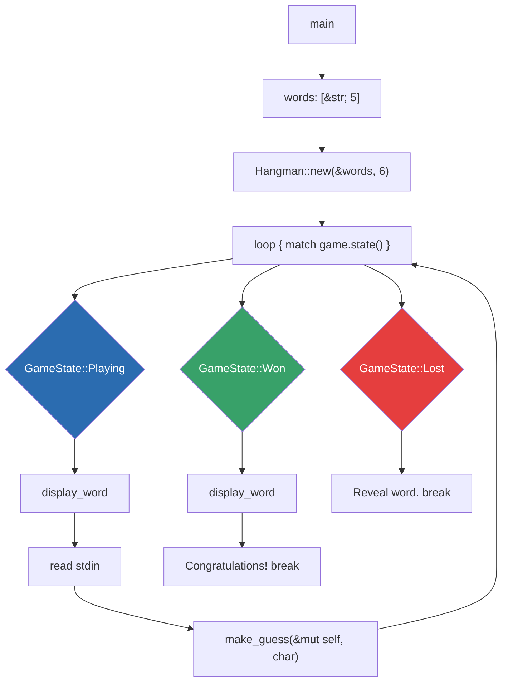
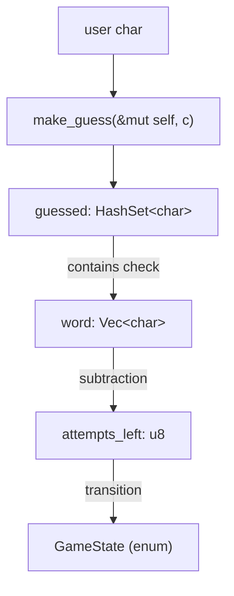
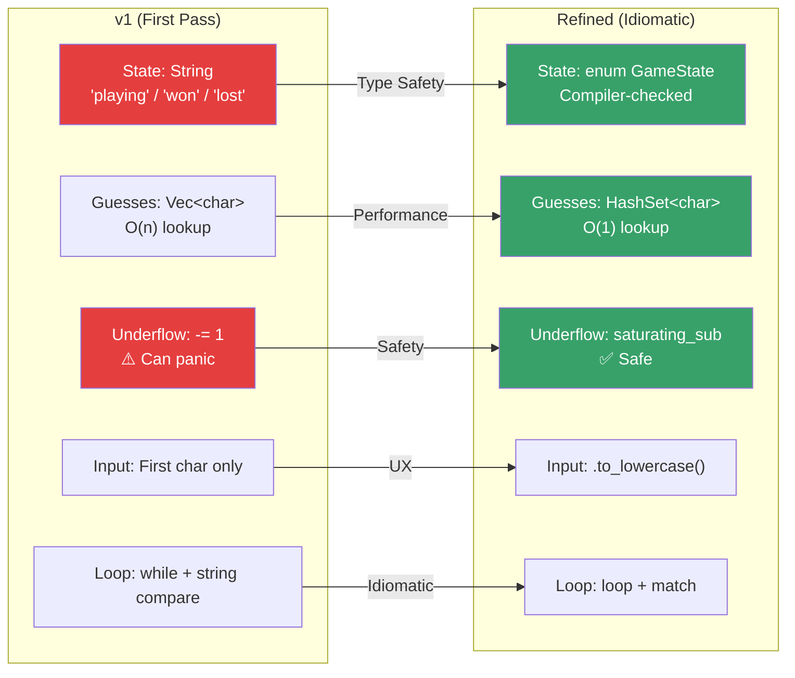

# Midterm Project Summary — Hangman in Rust

**Course:** CSEC Tool Development (CSC-7309) | **Week:** 4 | **Date:** 2025-01-29 | **Instructor:** Travis Czech

The Week 4 Hangman game is the largest integrated program written during the first half of the course. It exercises every concept introduced in Weeks 1–4 (variables, mutability, primitive types, ownership, borrowing, references, structs, methods, enums, and pattern matching) in a single working terminal application. Two versions were produced: a first-pass version written live in lecture (`hangman_v1`), and a refined version demonstrating idiomatic Rust patterns (`hangman_refined`).

---

## Project Overview

Build a single-player terminal Hangman game:

- Pick a random word from a fixed word list
- Reveal the word character-by-character as the player guesses letters correctly
- Limit the player to a fixed number of incorrect attempts (default: 6)
- Report win / loss and reveal the final word

## Objectives Achieved

| # | Objective | Evidence |
|---|---|---|
| 1 | Define a custom data type with `struct` | `struct Hangman { word, guessed, attempts_left }` |
| 2 | Implement behavior via `impl` blocks | `Hangman::new`, `state`, `display_word`, `make_guess` |
| 3 | Use an associated function as a constructor | `Hangman::new(&words, max_attempts)` |
| 4 | Use an `enum` to represent mutually exclusive states | `enum GameState { Playing, Won, Lost }` |
| 5 | Use `match` for exhaustive state handling | `match game.state() { … }` |
| 6 | Demonstrate ownership & borrowing | `&[&str]`, `&self`, `&mut self` |
| 7 | Use a third-party crate | `rand::seq::IndexedRandom::choose` (v0.9) |
| 8 | Use a standard-library collection | `HashSet<char>` (refined) / `Vec<char>` (v1) |
| 9 | Handle user input robustly | `io::stdin().read_line()` + trim + lowercase |
| 10 | Prevent panics with safe arithmetic | `.saturating_sub(1)` (refined) |

## Architecture

### Program Flow



### State Machine

```mermaid
stateDiagram-v2
    [*] --> Playing: Hangman::new()
    Playing --> Playing: Correct guess (letter in word)
    Playing --> Playing: Incorrect guess (attempts > 0)
    Playing --> Won: All letters guessed
    Playing --> Lost: attempts_left == 0
    Won --> [*]: 🎉 Congratulations
    Lost --> [*]: 💀 Game Over
```

### Data Flow



## Key Implementations

### 1. Random Word Selection

```rust
let chosen_word = words
    .choose(&mut rand::rng())
    .expect("Words list cannot be empty.");
```

Uses the `rand` crate's `IndexedRandom` trait (v0.9+; previously `SliceRandom` in v0.8). Returns `Option<&T>` — we `.expect()` with a message because an empty word list would be a programming error, not a runtime error the user could recover from.

### 2. Guess Processing (refined version)

```rust
fn make_guess(&mut self, letter: char) {
    if !self.guessed.contains(&letter) {
        self.guessed.insert(letter);
        if !self.word.contains(&letter) {
            self.attempts_left = self.attempts_left.saturating_sub(1);
            println!("Incorrect guess! Attempts left: {}", self.attempts_left);
        }
    } else {
        println!("You already guessed '{}'. Try another letter.", letter);
    }
}
```

### 3. Word Display with Masking

```rust
fn display_word(&self) {
    let display: String = self.word.iter()
        .map(|&c| if self.guessed.contains(&c) { c } else { '_' })
        .collect();
    println!("Word: {}", display);
}
```

### 4. State Check

```rust
fn state(&self) -> GameState {
    if self.word.iter().all(|&c| self.guessed.contains(&c)) {
        GameState::Won
    } else if self.attempts_left == 0 {
        GameState::Lost
    } else {
        GameState::Playing
    }
}
```

## v1 → Refined Changes (Improvements)



| Aspect | v1 | Refined | Reason |
|---|---|---|---|
| State | `String` | `enum GameState` | Type safety, compiler-checked |
| Guesses | `Vec<char>` | `HashSet<char>` | O(1) lookup vs. O(n) |
| Underflow | `x -= 1` | `.saturating_sub(1)` | No panic possible |
| Case | First char only | `.to_lowercase()` | User experience |
| Loop | `while` + `"playing"` | `loop` + `match` | Idiomatic Rust |
| Tests | None | 9 unit tests | Validates state transitions |

## Metrics

| Metric | v1 | Refined |
|---|---|---|
| Source lines (excl. comments/blanks) | ~75 | ~95 |
| Total source lines | 92 | 181 |
| Struct fields | 3 | 3 |
| Public methods | 5 | 4 |
| External crates | 1 (`rand`) | 1 (`rand`) |
| Stdlib collections | `Vec` | `Vec`, `HashSet` |
| Compiler warnings (target) | 0 | 0 |

## Evidence Links

- [scripts/hangman_v1/src/main.rs](scripts/hangman_v1/src/main.rs) — First-pass source
- [scripts/hangman_refined/src/main.rs](scripts/hangman_refined/src/main.rs) — Refined source
- [scripts/hangman_v1/Cargo.toml](scripts/hangman_v1/Cargo.toml) — Package manifest (v1)
- [scripts/hangman_refined/Cargo.toml](scripts/hangman_refined/Cargo.toml) — Package manifest (refined)
- [WEEKS_1-6_RUST_FUNDAMENTALS_SUMMARY.md](WEEKS_1-6_RUST_FUNDAMENTALS_SUMMARY.md) — Underpinning concepts

## Retrospective / Learning Reflection

**What worked:**

- Writing v1 first, then refactoring to idiomatic Rust, made the language's design choices much clearer. The compiler gently guided me from "works" to "idiomatic."
- `HashSet` was an obvious win once I saw `Vec::contains` is O(n).
- `enum GameState` made the control flow self-documenting.

**What was hard:**

- The borrow checker initially felt frustrating. Understanding *why* Rust forbids certain patterns (to prevent data races and use-after-free) made it less adversarial.
- Deciding when to `.clone()` vs. pass `&self` required a clearer mental model of heap allocations.

**What I'd do next:**

- Add unit tests for `make_guess` and `state` transitions
- Extract the word list to a file or CLI argument
- Add a text-based "gallows" visualization per wrong guess
- Internationalize the word list

## Attribution

Algorithm and initial live-coded implementation © Travis Czech (CSC-7309 lecture, 2025-01-29). Student refactoring, Cargo project structure, documentation, and analysis by Ross Moravec.

---

## Demo: Sample Game Session

```text
$ cargo run
    Finished `dev` profile [unoptimized + debuginfo] target(s) in 0.08s
     Running `target\debug\hangman_refined.exe`
Welcome to Hangman!
Word: ____
Enter your guess:
r
Word: r___
Enter your guess:
u
Word: ru__
Enter your guess:
z
Incorrect guess! Attempts left: 5
Word: ru__
Enter your guess:
s
Word: rus_
Enter your guess:
t
Word: rust
Congratulations! You guessed the word.
```

> [!NOTE]
> The word is randomly selected from `["rust", "hangman", "programming", "cipher", "encryption"]`. The session above shows a game where the target word was "rust".

---

## Unit Test Evidence

The refined version includes 9 unit tests that validate all state transitions and edge cases. Here are representative examples:

```rust
/// Helper: create a Hangman game with a known word for deterministic testing.
fn game_with_word(word: &str, max_attempts: u8) -> Hangman {
    Hangman {
        word: word.chars().collect(),
        guessed: HashSet::new(),
        attempts_left: max_attempts,
    }
}

#[test]
fn guessing_all_letters_wins() {
    let mut game = game_with_word("hi", 6);
    game.make_guess('h');
    game.make_guess('i');
    assert!(matches!(game.state(), GameState::Won));
}

#[test]
fn running_out_of_attempts_loses() {
    let mut game = game_with_word("rust", 2);
    game.make_guess('x');
    game.make_guess('y');
    assert!(matches!(game.state(), GameState::Lost));
}

#[test]
fn saturating_sub_prevents_underflow() {
    let mut game = game_with_word("rust", 1);
    game.make_guess('x'); // attempts_left → 0
    assert_eq!(game.attempts_left, 0);
    game.make_guess('y'); // already at 0, guarded by HashSet
    assert_eq!(game.attempts_left, 0);
}
```

```text
$ cargo test
   Compiling hangman_refined v0.2.0
    Finished `test` profile [unoptimized + debuginfo] target(s) in 0.62s
     Running unittests src/main.rs

running 9 tests
test tests::new_game_starts_in_playing_state ... ok
test tests::correct_guess_does_not_reduce_attempts ... ok
test tests::incorrect_guess_reduces_attempts ... ok
test tests::duplicate_guess_does_not_reduce_attempts ... ok
test tests::guessing_all_letters_wins ... ok
test tests::running_out_of_attempts_loses ... ok
test tests::saturating_sub_prevents_underflow ... ok
test tests::display_word_masks_unguessed_letters ... ok
test tests::display_word_reveals_guessed_letters ... ok

test result: ok. 9 passed; 0 failed; 0 ignored; 0 measured; 0 filtered out
```
