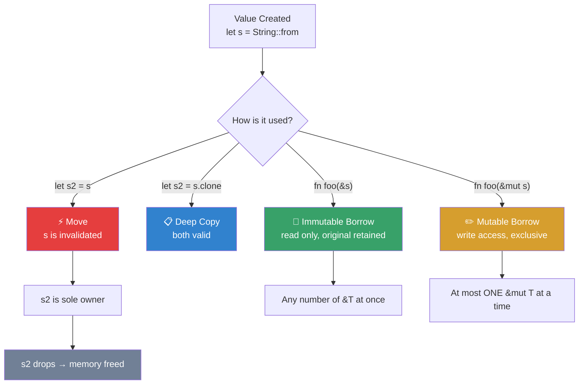

# Weeks 1–6 — Rust Fundamentals for Security Tool Development

**Course:** CSEC Tool Development (CSC-7309) | **Term:** Winter 2025 | **Instructor:** Travis Czech | **Institution:** Cambrian College

This document synthesizes the core Rust concepts taught in the first six weeks of CSEC Tool Development (the portion of the course available in this portfolio). Content is derived from live-coded lecture transcripts and two working code artifacts (the Week 4 Hangman game, in two iterations).

---

## Table of Contents

1. [Week 1 — Development Environment Setup](#week-1--development-environment-setup-2025-01-08)
2. [Week 2 — Variables, Mutability & Data Types](#week-2--variables-mutability--data-types-2025-01-15)
3. [Week 3 — Ownership, Borrowing & References](#week-3--ownership-borrowing--references-2025-01-22)
4. [Week 4 — Structs, Methods & Enums](#week-4--structs-methods--enums-2025-01-29)
5. [Week 5 — Applied Practice (Bug Hunt + Guessing Game)](#week-5--applied-practice-bug-hunt--guessing-game-2025-02-05)
6. [Week 6 — Midterm Preparation & Review](#week-6--midterm-preparation--review-2025-02-12)
7. [Consolidated Concept Index](#consolidated-concept-index)

---

## Week 1 — Development Environment Setup (2025-01-08)

### Objectives

- Install a functional Rust toolchain on the student's chosen OS
- Verify the install with `rustc --version` and `cargo --version`
- Install and configure Visual Studio Code as the course editor
- Create and run a first "Hello, World!" Cargo project

### Key Concepts

- **Rustup:** the official installer/updater for the Rust toolchain. Handles multiple toolchains and targets; simplifies upgrades.
- **Cargo:** Rust's build system and package manager. Every Rust project is (typically) a Cargo project.
- **VM-first security tooling:** security-focused code (keyloggers, scanners) should be developed and tested in an isolated VM (Kali Linux, Windows VM, or a disposable Ubuntu). The instructor explicitly cautioned against running security-tool experiments on a host OS.

### Commands Practiced

```bash
# Install Rustup (Linux/macOS)
curl --proto '=https' --tlsv1.2 -sSf https://sh.rustup.rs | sh

# Verify install
rustc --version
cargo --version

# Create a new Cargo project
cargo new week1
cd week1

# Build and run
cargo build
cargo run
```

### Cargo Project Anatomy Introduced

```
week1/
├── Cargo.toml          # package manifest (name, version, edition, dependencies)
├── Cargo.lock          # locked dependency versions (generated)
├── src/
│   └── main.rs         # entry point containing fn main()
└── target/             # build outputs (generated, .gitignore-worthy)
```

### Deliverable

A running `cargo run` that prints `Hello, world!` — confirming the toolchain works end-to-end.

---

## Week 2 — Variables, Mutability & Data Types (2025-01-15)

### Objectives

- Understand that Rust variables are **immutable by default**
- Use `let mut` to declare a mutable variable
- Identify and use the primitive data types
- Recognize Rust's strong type system and type inference

### Key Concepts

**Immutability by default:**

```rust
let x = 5;          // immutable
// x = 6;           // COMPILE ERROR: cannot assign twice to immutable variable
let mut y = 10;     // mutable
y += 5;             // OK; y is now 15
```

**Why immutable by default?** Part of Rust's memory-safety guarantees. Forcing the programmer to declare intent to mutate eliminates a large class of bugs.

**Primitive data types covered:**

| Type | Example | Notes |
|---|---|---|
| `i32` | `let a: i32 = 10;` | default integer width (32-bit signed) |
| `i8`, `i16`, `i64`, `i128` | `let small: i8 = 12;` | explicit width for memory optimization |
| `u8`, `u16`, `u32`, `u64` | `let byte: u8 = 255;` | unsigned variants |
| `f64` | `let pi: f64 = 3.14159;` | default floating-point (64-bit) |
| `f32` | `let half: f32 = 0.5;` | smaller floating-point |
| `bool` | `let b: bool = true;` | two states: `true` / `false` |
| `char` | `let c: char = 'A';` | Unicode scalar value (4 bytes) |
| `String` | `let s = String::from("hi");` | heap-allocated, growable |
| `&str` | `let s = "hi";` | string slice (borrowed reference) |

### Type Inference

Rust infers types from usage, but explicit annotations are always allowed and often clearer:

```rust
let a = 10;          // inferred as i32
let a: i32 = 10;     // explicit — equivalent
let f = 3.14;        // inferred as f64
```

### Shorthand Operators

```rust
y += 5;   // y = y + 5
y -= 1;   // y = y - 1
y *= 2;   // y = y * 2
```

### Security Context

Choosing narrower integer types (e.g. `u8` for a byte buffer) reduces memory footprint — useful when building lightweight security tools that may run resource-constrained.

---

## Week 3 — Ownership, Borrowing & References (2025-01-22)

*Three-part lecture. This is the cornerstone week for Rust fluency.*

### The Three Rules of Ownership

1. **Every value has exactly one owner.**
2. **There can be only one owner at a time.**
3. **When the owner goes out of scope, the value is dropped (memory freed).**

### Move Semantics

```rust
let s1 = String::from("hello");
let s2 = s1;                  // ownership MOVED to s2
// println!("{}", s1);        // COMPILE ERROR: value moved
println!("{}", s2);           // OK
```

The instructor's analogy: *"If I give you my house, I can't then try to list the house for sale."*

### `.clone()` for Deep Copies

```rust
let s1 = String::from("hello");
let s2 = s1.clone();          // s1 retained; s2 is a fresh allocation
println!("{} and {}", s1, s2);
```

### References & Borrowing

```rust
let s = String::from("hello");
let len = calculate_length(&s);    // pass by reference (borrow)
println!("'{}' has length {}", s, len);

fn calculate_length(input: &String) -> usize {
    input.len()
}
```

### Mutable References

```rust
let mut s = String::from("hello");
change(&mut s);

fn change(input: &mut String) {
    input.push_str(", world");
}
```

**Rules for references:**

- You may have any number of **immutable** references (`&T`) simultaneously.
- You may have **at most one mutable** reference (`&mut T`) at a time.
- You cannot mix mutable and immutable references with overlapping lifetimes.

This prevents data races **at compile time** — a major security property.

#### Ownership & Borrowing Visual Model



> [!NOTE]
> This diagram is the **single most important concept** in the first half of the course. Every subsequent topic (structs, enums, collections, security tools) builds on these ownership rules.

### Stack vs. Heap (brief)

- Stack: fixed-size, LIFO, fast (e.g., `i32`, `bool`, `char`)
- Heap: variable-size, slower, reachable through pointers (e.g., `String`, `Vec<T>`)

### In-Class Exercise

A **simple keylogger** exercise was introduced as a cross-platform (Windows / Linux / macOS) study in how ownership and borrowing apply to practical tool code. The keylogger was presented as an academic exercise to be run only in an isolated VM.

> [!WARNING]
> The keylogger exercise is for **defensive education only**. See the full writeup: [KEYLOGGER_STUDY_WEEK3.md](KEYLOGGER_STUDY_WEEK3.md)

### Why This Matters for Security Tools

Many vulnerabilities in C / C++ security tools stem from memory errors (use-after-free, double-free, buffer overruns). Rust's ownership model prevents these at compile time without a runtime garbage collector — making Rust an excellent systems language for tool development.

---

## Week 4 — Structs, Methods & Enums (2025-01-29)

*Two-part lecture. Applied via the Hangman game implementation.*

### Defining a Struct

```rust
struct User {
    name: String,
    age: u8,
    active: bool,
}
```

### Creating an Instance

```rust
let mut user1 = User {
    name: String::from("Travis"),
    age: 34,
    active: true,
};

println!("User: {}, Age: {}, Active: {}", user1.name, user1.age, user1.active);
user1.age = 35;
```

### Methods via `impl` Blocks

```rust
impl User {
    // Associated function (no self) — often used as a constructor
    pub fn new(name: String, age: u8) -> Self {
        User { name, age, active: true }
    }

    // Method (takes &self)
    pub fn greet(&self) {
        println!("Hello, {}!", self.name);
    }

    // Mutating method (takes &mut self)
    pub fn deactivate(&mut self) {
        self.active = false;
    }
}
```

**Terminology:**

- **Associated function:** defined in `impl` but doesn't take `self`. Called via `User::new(...)`.
- **Method:** takes `self`, `&self`, or `&mut self`. Called via `user1.greet()`.

### Enums

```rust
#[derive(Debug)]
enum GameState {
    Playing,
    Won,
    Lost,
}
```

Enums model *mutually exclusive* states. Paired with `match`, the compiler guarantees every case is handled.

### Pattern Matching

```rust
match game.state() {
    GameState::Playing => { /* … */ }
    GameState::Won => { /* … */ }
    GameState::Lost => { /* … */ }
}
```

### Hangman Game — Applied Project

Implemented live in class using all of the concepts above:

- `struct Hangman` with `word: Vec<char>`, `guessed: HashSet<char>`, `attempts_left: u8`
- Constructor `Hangman::new(&words, max_attempts)` — associated function
- Methods: `state() -> GameState`, `display_word(&self)`, `make_guess(&mut self, char)`
- Uses `rand::seq::SliceRandom::choose` for random word selection
- Uses `std::collections::HashSet` for O(1) guessed-letter lookup
- Uses `.saturating_sub(1)` to prevent underflow of `attempts_left`

Full source: see [scripts/hangman_v1/](scripts/hangman_v1/) and [scripts/hangman_refined/](scripts/hangman_refined/).

### Cryptography Pivot (intro)

The instructor signaled that structs would be applied to basic cryptographic primitives in subsequent weeks (e.g., state structs for cipher algorithms).

---

## Week 5 — Applied Practice (Bug Hunt + Guessing Game) (2025-02-05)

No new theory. Hands-on catch-up week.

### Assignment 1 — Bug Hunt

Students received pre-written Rust code containing deliberate bugs and were asked to:

1. Compile the code and read the compiler diagnostics
2. Fix each issue methodically
3. Run the corrected program and verify output

### Rust Book — Chapter 2 Guessing Game

Students walked through the official Rust Book tutorial:
<https://doc.rust-lang.org/book/ch02-00-guessing-game-tutorial.html>

Concepts reinforced:

- `use std::io` and reading from stdin
- `match` with error handling (`Result<T, E>`)
- `Ordering::{Less, Greater, Equal}` for numeric comparison
- Looping with `loop { … break; }`
- Shadowing: `let guess: u32 = guess.trim().parse().expect(...);`

### Breakout Room Support

Instructor provided help in Zoom breakout rooms for students working through the lab.

---

## Week 6 — Midterm Preparation & Review (2025-02-12)

### Materials Provided

- **Review worksheet** covering sections 1–5 of the course
- **Troubleshooting guide** for common compiler errors
- **Practice midterm** with sections 1–5 mirrored against the actual midterm format

### Labs Reopened

- Lab 1 (environment / variables)
- Lab 2 (ownership / borrowing)
- Lab 3 (structs / methods)

Students could re-submit or catch up on any of these labs.

### Review Topics Consolidated

Sections 1–5 of the course correspond to:

1. **Section 1:** Environment & cargo workflow
2. **Section 2:** Variables, mutability, data types
3. **Section 3:** Ownership, borrowing, references
4. **Section 4:** Structs, methods, enums
5. **Section 5:** Applied programming (Hangman, Guessing Game, Bug Hunt)

### Self-Assessment Checklist (derived)

- [ ] I can create a new Cargo project and add a dependency
- [ ] I can explain mutability and write both `let` and `let mut` correctly
- [ ] I can name and use 6+ Rust primitive types
- [ ] I can state the 3 ownership rules
- [ ] I can distinguish a move, a borrow (`&T`), and a mutable borrow (`&mut T`)
- [ ] I can define a struct with fields and implement methods on it
- [ ] I can define an enum and handle it with `match`
- [ ] I can read compiler errors and correct ownership / type issues
- [ ] I can read from stdin, parse input, and loop until a condition

---

## Consolidated Concept Index

### Language Features

| Concept | First Introduced | Reinforced In |
|---|---|---|
| `let` / `let mut` | Week 2 | Weeks 3–6 |
| Primitive types (i32, f64, bool, char, String) | Week 2 | All |
| Type inference vs. annotations | Week 2 | All |
| The three ownership rules | Week 3 | Weeks 4–6 |
| Move semantics | Week 3 | Week 4 (HashSet, Vec) |
| `.clone()` | Week 3 | Week 4 |
| References `&T` / `&mut T` | Week 3 | Weeks 4–6 |
| `struct` definition | Week 4 | Weeks 5–6 |
| `impl` blocks | Week 4 | Weeks 5–6 |
| Associated functions (`::new`) | Week 4 | Weeks 5–6 |
| Methods (`&self`, `&mut self`) | Week 4 | Weeks 5–6 |
| `enum` definition | Week 4 (Hangman) | Weeks 5–6 |
| `match` pattern matching | Week 4 (Hangman) | Weeks 5–6 |
| `Vec<T>`, `HashSet<T>` | Week 4 | — |
| `Result<T, E>` & `.expect()` | Week 5 (Guessing Game) | — |
| `std::io::stdin().read_line()` | Weeks 4–5 | — |

### External Crates Used

| Crate | Version | Used For |
|---|---|---|
| `rand` | 0.8 | Random word selection in Hangman |

### Tools

| Tool | Purpose |
|---|---|
| Rustup | Toolchain installer/updater |
| Cargo | Build system + package manager |
| `rustc` | Rust compiler |
| VS Code + Rust extension | IDE / editor |
| Virtual machine (Kali / Ubuntu / Win) | Isolated dev environment for security tooling |

---

## Attribution

Original lecture content © Travis Czech / Cambrian College (CSEC Tool Development, CSC-7309, Winter 2025). This summary is a student synthesis prepared by Ross Moravec for educational portfolio purposes. Direct transcripts remain the property of the instructor and the institution.
