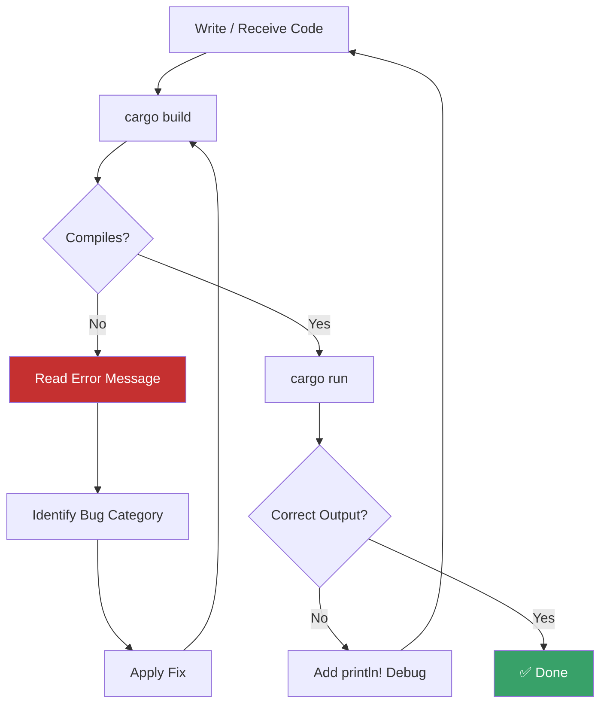

# Assignment 1 — Bug Hunt (Week 5)

**Course:** CSEC Tool Development (CSC-7309) | **Week:** 5 | **Date:** 2025-02-05 | **Instructor:** Travis Czech

---

## Assignment Description

Students received pre-written Rust code containing **deliberate bugs** and were tasked with:

1. Compiling the code and reading the compiler diagnostics
2. Identifying and fixing each issue methodically
3. Running the corrected program and verifying output

## Methodology

> [!TIP]
> The Bug Hunt exercise reinforces the **"read the compiler error → understand → fix"** methodology that is central to Rust development. Unlike C/C++ where compiler errors can be cryptic, Rust's compiler (`rustc`) provides specific, actionable error messages.

### Common Bug Categories Encountered

| Bug Type | Rust Compiler Error | Fix |
|---|---|---|
| **Immutable variable reassignment** | `cannot assign twice to immutable variable` | Add `mut` keyword: `let mut x = 5;` |
| **Ownership move after use** | `value used here after move` | Use `.clone()` or pass by reference (`&`) |
| **Type mismatch** | `expected i32, found &str` | Parse string to integer: `.parse::<i32>()` |
| **Missing `mut` on reference** | `cannot borrow as mutable` | Change `&self` to `&mut self` |
| **Unused variable** | `unused variable: x` (warning) | Prefix with `_` or remove |
| **Missing match arms** | `non-exhaustive patterns` | Add all enum variants to `match` |

### Debugging Process (Applied)



## Example: Fixing an Ownership Bug

**Before (buggy):**

```rust
fn main() {
    let s1 = String::from("hello");
    let s2 = s1;           // s1 moved to s2
    println!("{}", s1);    // ERROR: value used after move
}
```

**Compiler output:**

```text
error[E0382]: borrow of moved value: `s1`
 --> src/main.rs:4:20
  |
2 |     let s1 = String::from("hello");
  |         -- move occurs because `s1` has type `String`
3 |     let s2 = s1;
  |              -- value moved here
4 |     println!("{}", s1);
  |                    ^^ value borrowed here after move
```

**After (fixed):**

```rust
fn main() {
    let s1 = String::from("hello");
    let s2 = s1.clone();       // deep copy — s1 retained
    println!("{}", s1);        // OK
    println!("{}", s2);        // OK
}
```

## Concepts Reinforced

- **Compiler-guided development** — Rust's error messages are detailed enough to serve as a learning tool
- **Ownership rules** — Every move, borrow, and lifetime error traces back to the three ownership rules
- **Iterative fix-compile-test loop** — The core development workflow for systems programming
- **Pattern matching completeness** — The compiler enforces exhaustive `match` coverage

## Learning Outcome

The Bug Hunt exercise demonstrated that Rust's compiler is not an obstacle — it is a **teaching tool and safety net**. In a security context, the same compiler checks that catch these educational bugs also prevent the memory-safety vulnerabilities (buffer overflows, use-after-free, data races) that plague C/C++ security tools.

## Attribution

Assignment design © Travis Czech / Cambrian College (CSC-7309, Week 5, 2025-02-05). Student writeup by Ross Moravec.
