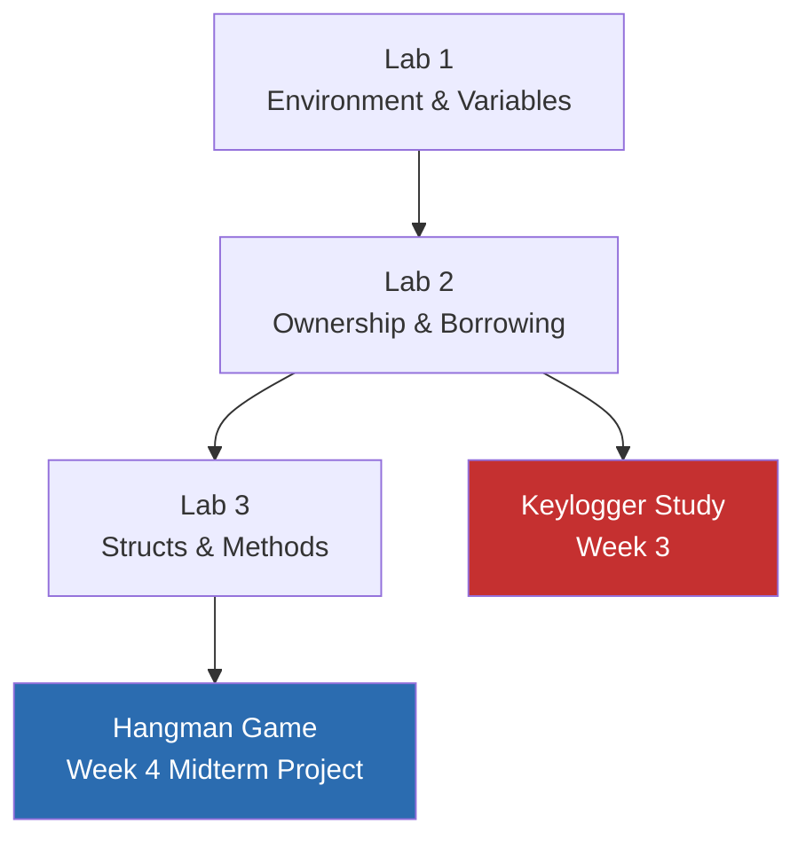

# Labs 1–3 Summary

**Course:** CSEC Tool Development (CSC-7309) | **Term:** Winter 2025 | **Instructor:** Travis Czech

---

## Overview

Three hands-on labs were assigned during Weeks 1–5, with all three reopened for catch-up during the Week 6 midterm review session. Each lab reinforced the core Rust concepts introduced in the corresponding lecture.

---

## Lab 1 — Environment & Variables (Weeks 1–2)

### Objectives

- Install Rust toolchain (Rustup, Cargo, rustc)
- Create a Cargo project and verify with `cargo run`
- Experiment with variables, mutability, and primitive types

### Key Exercises

```rust
// Immutability demonstration
let x = 5;
// x = 6;           // ← COMPILE ERROR: cannot assign to immutable variable

let mut y = 10;
y += 5;             // OK — y is mutable
println!("y = {}", y);  // → y = 15

// Type annotations
let age: u8 = 25;
let pi: f64 = 3.14159;
let initial: char = 'R';
let active: bool = true;
```

### Verification

- `rustc --version` → confirmed toolchain installation
- `cargo new lab1 && cd lab1 && cargo run` → "Hello, world!" output
- Experimented with type inference vs. explicit annotations

---

## Lab 2 — Ownership & Borrowing (Week 3)

### Objectives

- Demonstrate the three ownership rules in code
- Use references (`&T`) and mutable references (`&mut T`)
- Understand move semantics vs. `.clone()`

### Key Exercises

```rust
// Move semantics
let s1 = String::from("hello");
let s2 = s1;              // s1 is MOVED — no longer valid
// println!("{}", s1);    // ← COMPILE ERROR

// Borrowing (immutable reference)
let s3 = String::from("world");
let len = calculate_length(&s3);    // borrow, don't move
println!("'{}' is {} bytes", s3, len);

fn calculate_length(s: &String) -> usize {
    s.len()
}

// Mutable reference
let mut s4 = String::from("hello");
append_world(&mut s4);
println!("{}", s4);  // → "hello, world"

fn append_world(s: &mut String) {
    s.push_str(", world");
}
```

### Verification

- Intentionally triggered ownership errors to observe compiler messages
- Fixed errors using references, cloning, and mutable borrows
- Confirmed understanding: only one `&mut T` OR any number of `&T` at a time

---

## Lab 3 — Structs & Methods (Week 4)

### Objectives

- Define custom types with `struct`
- Implement methods via `impl` blocks
- Use `enum` for mutually exclusive states

### Key Exercises

```rust
struct Rectangle {
    width: f64,
    height: f64,
}

impl Rectangle {
    fn new(width: f64, height: f64) -> Self {
        Rectangle { width, height }
    }

    fn area(&self) -> f64 {
        self.width * self.height
    }

    fn is_square(&self) -> bool {
        (self.width - self.height).abs() < f64::EPSILON
    }
}

let rect = Rectangle::new(10.0, 5.0);
println!("Area: {}", rect.area());        // → 50.0
println!("Square? {}", rect.is_square()); // → false
```

### Verification

- Created and tested struct with multiple methods
- Used associated function (`::new`) as constructor pattern
- Connected patterns to the Hangman game implementation in the same week

---

## Relationship to Portfolio Artifacts



Each lab builds directly on the previous one. Lab 3's struct patterns are immediately applied in the Week 4 Hangman project, and Lab 2's ownership concepts appear in the Week 3 keylogger study.

---

## My Implementation & Challenges

### Lab 1 — What Tripped Me Up

The difference between `String` and `&str` was confusing at first. I tried to do:

```rust
let name: &str = String::from("Ross");  // ERROR: expected &str, found String
```

The compiler told me the types don't match. I learned that `String` is an owned, heap-allocated string, while `&str` is a borrowed reference to string data. The fix: either `let name: String = String::from("Ross")` or `let name: &str = "Ross"` (string literal is already a `&str`).

### Lab 2 — When Ownership "Clicked"

The moment ownership clicked was when I tried to pass a `String` to a function and then use it afterwards:

```rust
fn print_greeting(name: String) {
    println!("Hello, {}!", name);
}

fn main() {
    let my_name = String::from("Ross");
    print_greeting(my_name);
    println!("My name is: {}", my_name);  // ERROR: value moved
}
```

```text
error[E0382]: borrow of moved value: `my_name`
 --> src/main.rs:8:35
  |
6 |     let my_name = String::from("Ross");
  |         ------- move occurs because `my_name` has type `String`
7 |     print_greeting(my_name);
  |                    ------- value moved here
8 |     println!("My name is: {}", my_name);
  |                                ^^^^^^^ value borrowed here after move
```

The fix was to change the function to borrow: `fn print_greeting(name: &String)` and call it with `print_greeting(&my_name)`. This was the "house analogy" from the lecture in action — I was trying to give away my house and then walk back in.

### Lab 3 — Connecting Structs to Hangman

After completing the Rectangle exercise, I immediately saw how the same `struct` + `impl` + `::new()` pattern would apply to the Hangman game. The `is_square()` method taking `&self` was the same pattern as Hangman's `state(&self)` — an immutable borrow that checks data without modifying it. This connection made Lab 3 feel less like an isolated exercise and more like preparation for a real project.

### Verification Evidence

```text
$ cd lab1 && cargo run
   Compiling lab1 v0.1.0
    Finished `dev` profile target(s) in 0.32s
     Running `target/debug/lab1`
Hello, world!
y = 15

$ cd ../lab3 && cargo run
   Compiling lab3 v0.1.0
    Finished `dev` profile target(s) in 0.28s
     Running `target/debug/lab3`
Area: 50
Square? false
```

## Attribution

Lab design and exercises © Travis Czech / Cambrian College (CSC-7309, Winter 2025). Student summaries by Ross Moravec.

## Competencies Achieved

### Lab 1 — Environment & Variables

- [x] Install and verify Rust toolchain (rustup, cargo, rustc)
- [x] Create and run a Cargo project from scratch
- [x] Declare variables with explicit type annotations
- [x] Understand mutability (`let` vs `let mut`)
- [x] Distinguish between `String` and `&str`

### Lab 2 — Ownership & Borrowing

- [x] Demonstrate the three ownership rules in code
- [x] Trigger and resolve ownership errors (`E0382`, `E0505`)
- [x] Use immutable references (`&T`) and mutable references (`&mut T`)
- [x] Understand move semantics vs. `.clone()`
- [x] Apply the "one mutable OR many immutable" borrowing rule

### Lab 3 — Structs & Methods

- [x] Define custom types with `struct`
- [x] Implement methods and associated functions via `impl` blocks
- [x] Use `&self` for immutable method access
- [x] Connect struct patterns to the Hangman game architecture
