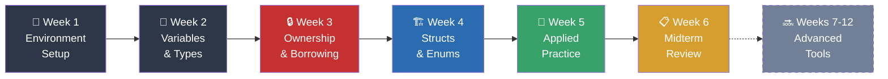
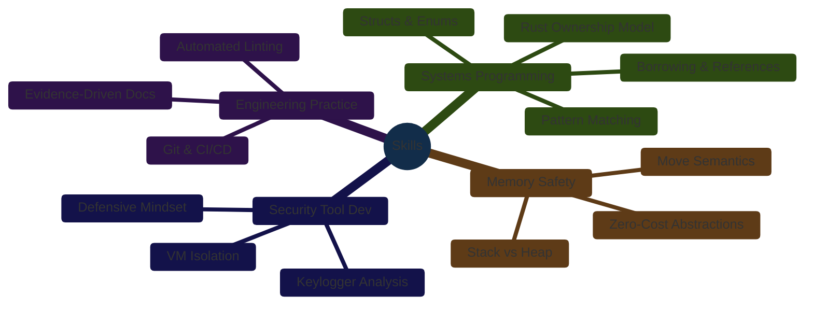

# CSEC Tool Development — Portfolio (CSC-7309, Winter 2025)

[](https://github.com/RossMora/407-tool-development/actions/workflows/ci.yml)
[](https://github.com/RossMora/407-tool-development/actions/workflows/portfolio-ci.yml)
[](https://github.com/RossMora/407-tool-development/actions/workflows/markdownlint.yml)
[](https://github.com/RossMora/407-tool-development/actions/workflows/gitleaks.yml)

> **Public portfolio** documenting learning outcomes, Rust code artifacts, and weekly synthesis from **CSEC Tool Development (CSC-7309)** — a Winter 2025 course in the Postgraduate Cybersecurity Certificate at **Cambrian College** (Sudbury, Ontario), taught by **Instructor Travis Czech**.

---

## Quick Start (For Hiring Managers)

| If you have… | Look at |
|---|---|
| **5 minutes** | This README + [Course README](CC/Winter%202025/CSEC%20Tool%20Development%20-%20Travis%20Czech%20-%20CSC-7309/README.md) |
| **15 minutes** | [Weekly Summary (Weeks 1–6)](CC/Winter%202025/CSEC%20Tool%20Development%20-%20Travis%20Czech%20-%20CSC-7309/WEEKS_1-6_RUST_FUNDAMENTALS_SUMMARY.md) + [Midterm Project Summary](CC/Winter%202025/CSEC%20Tool%20Development%20-%20Travis%20Czech%20-%20CSC-7309/MIDTERM_PROJECT_SUMMARY.md) |
| **30 minutes** | Above + [Hangman Rust Source](CC/Winter%202025/CSEC%20Tool%20Development%20-%20Travis%20Czech%20-%20CSC-7309/scripts/) + [Evidence Index](CC/Winter%202025/CSEC%20Tool%20Development%20-%20Travis%20Czech%20-%20CSC-7309/EVIDENCE_INDEX.md) |

---

## Course At a Glance

- **Institution:** Cambrian College, Sudbury, Ontario
- **Program:** Postgraduate Cybersecurity Certificate
- **Course:** CSEC Tool Development — CSC-7309 (Section 11821-002)
- **Term:** Winter 2025 (January – February 2025)
- **Instructor:** Travis Czech
- **Primary Language:** Rust (via Rustup + Cargo)
- **Ancillary Tools:** Visual Studio Code, Git, Virtual Machines (Linux/Windows)
- **Content Coverage (Weeks 1–6):** Development environment → Rust fundamentals → Ownership/Borrowing → Structs & Enums → Lab practice → Midterm review

---

## Key Topics Covered



| Topic | Weeks | Learning Outcomes |
|---|---|---|
| **Environment Setup** | 1 | Install Rustup toolchain, Cargo package manager, VS Code + extensions, configure isolated VM for tool development |
| **Rust Fundamentals** | 2 | Variables, mutability (`let` / `let mut`), integer/float/boolean/char/string types, type inference, strong-typing guarantees |
| **Ownership & Borrowing** | 3 | Three ownership rules, `&` references, mutable vs. immutable borrows, memory safety without GC, `.clone()` semantics |
| **Structs & Methods** | 4 | Custom types via `struct`, `impl` blocks, associated functions, enums (`GameState`), `HashSet` for O(1) lookups |
| **Applied Practice** | 5 | Debugging exercises ("Bug Hunt"), guessing-game tutorial, self-paced lab work |
| **Midterm Review** | 6 | Consolidation of sections 1–5, practice midterm, troubleshooting guide, labs reopened |

---

## Repository Navigation

```
407-Tool-Development/
├── CC/Winter 2025/CSEC Tool Development - Travis Czech - CSC-7309/
│   ├── README.md                              — Course-level portfolio entry point
│   ├── WEEKS_1-6_RUST_FUNDAMENTALS_SUMMARY.md — Synthesized weekly concepts + diagrams
│   ├── MIDTERM_PROJECT_SUMMARY.md             — Hangman project (architecture + metrics)
│   ├── KEYLOGGER_STUDY_WEEK3.md               — 🔒 Security tool analysis (Week 3)
│   ├── FINAL_PROJECT_TOOL_DEVELOPMENT.md      — Phase 1 methodology + skills viz
│   ├── EVIDENCE_INDEX.md                      — Complete artifact index (11 diagrams)
│   ├── SCRIPTS_README.md                      — Rust source inventory (3 projects)
│   ├── assignments/                           — Bug Hunt, Guessing Game, Labs 1–3
│   ├── scripts/                               — Rust code (Hangman ×2 + Guessing Game)
│   ├── scripts-extra/                         — External refs + instructor URLs
│   └── screenshots/                           — Evidence images
├── docs/                                      — Pilot-level operations docs
├── portfolio/config.json                      — Metrics, skills, references
├── rustfmt.toml                               — Rust formatting config
├── clippy.toml                                — Rust linting config
├── scripts/                                   — PM automation (pm.sh + helpers)
├── .github/workflows/                         — CI/CD (8 workflows)
├── templates/                                 — Reusable .tpl files
├── unified-skills/                            — Vendor-agnostic skill library
├── artifacts/                                 — Generated PM outputs
├── sessions/                                  — Work session audit trail
├── AGENTS.md                                  — Agent/session entry point
├── CONTRIBUTING.md                            — PM conventions
└── ROADMAP.md                                 — Now / Next / Later / Milestones
```

---

## Skills Demonstrated



- **Systems Programming:** Rust (ownership model, borrowing, lifetimes-lite, structs/enums, trait-adjacent patterns)
- **Memory Safety:** Understanding of stack vs. heap, move semantics, zero-cost abstractions
- **Tool Development Mindset:** Building bespoke security utilities rather than relying on off-the-shelf tools
- **Secure Development Practice:** Isolated VM usage for security-tool work, responsible-use disclosures
- **Software Engineering Hygiene:** Version control (Git), commit discipline, linting, CI/CD, evidence-driven documentation
- **Project Management:** Roadmap-first workflow, automated evidence collection, structured session capture

---

## Responsible-Use Notice

> [!CAUTION]
> This repository contains educational material related to security tool development. Code examples and concepts (e.g., simple keylogger structure, scanner patterns) were studied in an academic, sandboxed context. **All published artifacts are intended for defensive education only.** Do not deploy against systems you do not own or have explicit authorization to test. Respect local laws (Canadian Criminal Code s. 342.1, CFAA) and institutional policies.

---

## Attribution

- **Original lecture content:** Travis Czech (Cambrian College, CSC-7309, Winter 2025)
- **Repository author:** Ross Moravec (student portfolio)
- **Template origin:** Pilot 009 — Course Repository Template and Guidelines
- **Sibling pilots:** Pilot 008 (Network Defense), Pilot 010 (Intro to Cybersecurity)

---

## License & Usage

Educational portfolio — original lecture content remains © Travis Czech / Cambrian College. Student-authored notes, summaries, and code adaptations in this repository are shared for learning and evaluation purposes. See repository settings and attribution in each file for specifics.
