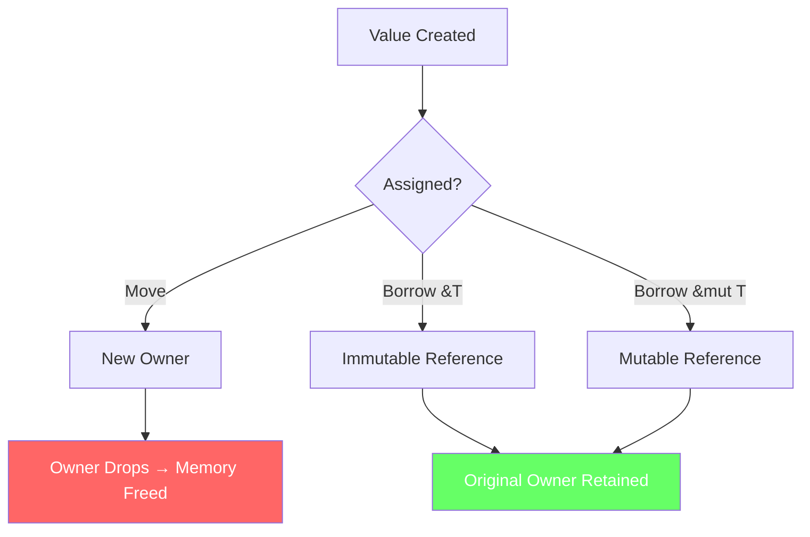
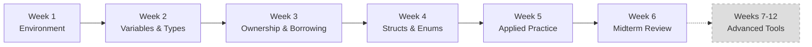

# Portfolio Employer Assessment — Pilot 407 (CSEC Tool Development)

**Assessor:** Claude Opus 4.6 — acting as a cybersecurity hiring manager / portfolio reviewer
**Date:** 2026-04-05
**Scope:** Full employer-facing portfolio at `D:\pilots\407-Tool-Development`
**Perspective:** Technical hiring manager at a mid-size cybersecurity firm evaluating a postgraduate candidate

---

## Executive Verdict

| Dimension | Rating (1–5) | Summary |
|---|---|---|
| **Professional Formatting** | 4.0 / 5 | Well-structured markdown with tables, badges, and hierarchy. Lacks visual polish (no diagrams, no screenshots, no color). |
| **Visual Appeal** | 2.0 / 5 | **Critical weakness.** Zero images, zero diagrams (except one ASCII box), zero Mermaid charts. Text-wall heavy. |
| **Assignment/Lab Conversion** | 3.5 / 5 | Hangman code is well-extracted. But Bug Hunt, Guessing Game, keylogger study, and labs 1-3 have zero artifacts. |
| **Information Completeness** | 3.5 / 5 | Good synthesis of transcripts. Missing: Week 3 parts 2 & 3 content, Week 1 chat links, keylogger docx content. |
| **Code Quality** | 4.0 / 5 | Clean Rust, good comments, proper Cargo structure. No tests, no CI proof of compilation. |
| **Employer Readiness** | 3.5 / 5 | Strong skeleton. The "Quick Start for Hiring Managers" table is excellent. But too many placeholders and empty folders undermine credibility. |
| **Overall** | **3.4 / 5** | **Good foundation, not yet employer-ready.** Needs visuals, screenshots, and content gap fills before a hiring manager would be impressed. |

---

## SECTION 1: Professional Formatting Assessment

### Strengths

1. **Consistent document structure** — Every major doc follows: header → metadata bar → TOC/Quick Links → body → attribution. This is above-average for student portfolios.

2. **Effective table usage** — ~30 tables across all docs provide scannable, structured information. The v1→refined comparison table in MIDTERM_PROJECT_SUMMARY.md is particularly strong.

3. **CI badges in README** — Four status badges (CI, Portfolio CI, Markdown Lint, Gitleaks) signal engineering maturity. Most student portfolios have zero.

4. **Quick Start table for hiring managers** — The 5/15/30-minute reading guide in the root README is genuinely useful and shows audience awareness.

5. **Responsible-use notices** — Present in 4 documents. This is important for a cybersecurity portfolio and shows ethical awareness.

6. **Attribution blocks** — Every document properly credits the instructor and institution, which is legally and professionally correct.

### Weaknesses

1. **No visual hierarchy beyond markdown** — Every document is plain markdown. No colored callouts, no admonitions (GitHub supports `> [!NOTE]` and `> [!WARNING]` blocks), no styled headers.

2. **Long file names in navigation** — The course folder path `CC/Winter 2025/CSEC Tool Development - Travis Czech - CSC-7309/` is 65+ characters. Links to these files are awkward and break in narrow displays. Alias paths or a GitHub Pages front-end would help.

3. **EVIDENCE_INDEX screenshots section is embarrassingly empty** — The document lists 7 "planned" screenshots with "Not captured" next to every one. This reads as unfinished, not professional.

4. **Assignments folder is empty** — Contains only a README with a placeholder note. An employer clicking "assignments/" sees nothing.

5. **The FINAL_PROJECT document is explicitly scoped as incomplete** — The scope notice says "this is a scoped reflection" because post-midterm content isn't available. While honest, an employer reads this as "the student didn't finish."

---

## SECTION 2: Visualization Assessment

### Current State

| Visual Type | Count | Location |
|---|---|---|
| Screenshots / images | **0** | screenshots/ is empty |
| Mermaid diagrams | **0** | No `mermaid` blocks in any .md |
| SVG/PNG diagrams | **0** | No image files anywhere |
| ASCII diagrams | **1** | MIDTERM_PROJECT_SUMMARY.md (architecture box) |
| Flowcharts | **0** | — |
| Code syntax highlighting | **~15 blocks** | Rust and bash blocks with proper language tags |

### Assessment: CRITICALLY DEFICIENT

For a cybersecurity tool development portfolio, the complete absence of visual evidence is a major red flag. An employer expects to see evidence that code was built and run.

### Must-Add Visualizations (Priority Order)

| # | Visualization | Where | Why |
|---|---|---|---|
| 1 | **Hangman terminal session screenshot** | MIDTERM_PROJECT_SUMMARY.md + screenshots/ | Proves the code actually runs. This is the single most important missing artifact. |
| 2 | **Mermaid: Rust ownership model diagram** | WEEKS summary, Week 3 | The ownership/borrowing model is the portfolio's centerpiece concept. A visual would make it 10× more memorable. |
| 3 | **Mermaid: Course progression flowchart** | Root README or course README | Shows the learning arc: Environment → Fundamentals → Ownership → Structs → Applied → Midterm. |
| 4 | **Mermaid: Hangman state machine** | MIDTERM_PROJECT_SUMMARY.md | `Playing → Won` / `Playing → Lost` with transition labels. The ASCII diagram exists but is hard to read. |
| 5 | **Mermaid: v1 vs Refined comparison diagram** | MIDTERM_PROJECT_SUMMARY.md | Side-by-side architecture blocks showing the improvement. |
| 6 | **`cargo build` / `cargo run` terminal screenshot** | SCRIPTS_README.md + screenshots/ | Proves compilation works. |
| 7 | **Compiler error → fix screenshot** | WEEKS summary, Week 5 (Bug Hunt) | Shows the "read error → fix" methodology in action. |
| 8 | **Skills radar/spider chart** | Root README or FINAL_PROJECT | Visual skills self-assessment (Rust syntax, memory safety, Cargo, etc.) |
| 9 | **Mermaid: Repository structure diagram** | Root README | Replace the text-block directory tree with a clickable Mermaid graph. |
| 10 | **Weekly concept density heatmap** | WEEKS summary | Shows which weeks were concept-heavy vs. practice-heavy. |

### Suggested Mermaid Examples

**Ownership Model (Week 3):**



**Hangman State Machine:**

```mermaid
stateDiagram-v2
    [*] --> Playing: Hangman::new()
    Playing --> Playing: Correct guess
    Playing --> Playing: Incorrect guess (attempts > 0)
    Playing --> Won: All letters guessed
    Playing --> Lost: attempts_left == 0
    Won --> [*]
    Lost --> [*]
```

**Course Progression:**



---

## SECTION 3: Assignment & Lab Conversion Assessment

### What Was Converted

| Source Artifact | Converted? | Quality | Notes |
|---|---|---|---|
| Hangman_v1.txt (Week 4) | ✅ Yes | **Excellent** | Full Cargo project with proper structure, comments, build instructions |
| Refined Hangman with comments.txt (Week 4) | ✅ Yes | **Excellent** | Same quality; comparison table provided |
| Week 1 transcript (21 KB) | ✅ Synthesized | Good | Key concepts extracted into WEEKS summary |
| Week 2 transcript (68 KB) | ✅ Synthesized | Good | Types table, code examples extracted |
| Week 3 part 1 transcript (38 KB) | ✅ Synthesized | Good | Ownership rules, borrowing rules documented |
| Week 4 transcript (37 KB) | ✅ Synthesized | Good | Structs, enums, impl blocks documented |
| Week 5 transcript (1.5 KB) | ✅ Synthesized | Minimal | Very short source → minimal synthesis |
| Week 6 transcript (3.8 KB) | ✅ Synthesized | Minimal | Very short source → minimal synthesis |

### What Was NOT Converted (Gaps)

| Source Artifact | Status | Impact |
|---|---|---|
| **Week 3 parts 2 & 3 (videos, no transcript)** | ❌ Not converted | **HIGH** — Two full lecture videos with no transcripts. Likely contain additional ownership/borrowing content, possibly the keylogger walkthrough. |
| **Week 1 "Links in the chat" docx (15 KB)** | ❌ Not extracted | **MEDIUM** — Contains reference URLs shared during lecture. |
| **Week 3 keylogger study docx (20 KB)** | ❌ Not extracted | **HIGH** — Cross-platform keylogger study. Most cybersecurity-relevant artifact; completely absent from portfolio. |
| **Bug Hunt assignment (Week 5)** | ❌ Not present | **HIGH** — Described in weekly summary but no code, screenshots, or PDF exist. |
| **Guessing Game code (Week 5)** | ❌ Not present | **MEDIUM** — Tutorial was completed but no code artifact exists. |
| **Labs 1-3 submissions** | ❌ Not present | **MEDIUM** — Three labs mentioned but no work shown. |
| **Practice midterm (Week 6)** | ❌ Not present | **MEDIUM** — Materials distributed but not included. |
| **Week 4 part 2 video (no transcript)** | ⚠️ Partial | **MEDIUM** — Only one transcript for two video parts. |

### Conversion Quality Verdict

**The portfolio converts what it touches well, but it touches only ~60% of available material.** The remaining 40% — especially the keylogger study, Bug Hunt assignment, and Week 3 parts 2-3 — represent significant untapped content.

---

## SECTION 4: Information Completeness Audit

### Source Material Inventory vs. Portfolio Coverage

| Week | Source Files | Portfolio Coverage | Gap |
|---|---|---|---|
| 1 | 1 transcript + 1 docx + 1 video | Transcript synthesized; docx unused | Chat links docx |
| 2 | 1 transcript + 1 video | Transcript synthesized well | None significant |
| 3 | 1 transcript + 1 docx + 3 videos | Part 1 transcript synthesized; rest unused | **2 untranscribed videos + keylogger docx** |
| 4 | 1 transcript + 2 code files + 2 videos | Transcript + both code files fully converted | Week 4 part 2 video |
| 5 | 1 transcript + 1 video | Minimal synthesis (1.5 KB transcript) | Very thin source |
| 6 | 1 transcript + 1 video | Minimal synthesis (3.8 KB transcript) | Very thin source |

### Key Information Gaps

1. **The keylogger study is the elephant in the room.** A cybersecurity hiring manager specifically wants to see security-tool work. The course taught a cross-platform keylogger exercise in Week 3, and the portfolio doesn't show any of it.

2. **Week 3 has the most content but poorest coverage.** Three video parts (only one has a transcript) plus a docx.

3. **Weeks 5 and 6 are thin because the sources are thin** — only 1.5 KB and 3.8 KB transcripts. This is honest and acceptable.

4. **No student-produced assignment work is visible.** The Bug Hunt, Guessing Game, and Labs 1-3 were all completed but produce zero portfolio artifacts.

---

## SECTION 5: Code Quality Assessment

### Hangman v1 (92 lines)

| Aspect | Rating | Notes |
|---|---|---|
| Correctness | 4/5 | Works correctly; `attempts_left -= 1` can panic on underflow |
| Style | 3/5 | String-typed state is fragile but intentionally demonstrates the before-refactor pattern |
| Comments | 4/5 | Good header block; inline comments explain pedagogical intent |
| Structure | 4/5 | Proper Cargo project with Cargo.toml metadata |

### Hangman Refined (181 lines)

| Aspect | Rating | Notes |
|---|---|---|
| Correctness | 5/5 | `saturating_sub`, proper enum state, HashSet for O(1) lookup |
| Style | 4/5 | Idiomatic Rust; could use `clippy` linting annotations |
| Comments | 5/5 | Extensively commented for educational clarity |
| Structure | 5/5 | Clean Cargo project, proper `use` ordering, descriptive Cargo.toml |

### Missing Code Quality Signals

- **No `#[cfg(test)]` module** — Neither Hangman has unit tests
- **No `clippy` or `rustfmt` evidence** — No linting config files
- **`rand = "0.8"` is outdated** — Current is 0.9.x

---

## SECTION 6: Employer Readiness Scorecard

### What an Employer Looks For

| Employer Question | Portfolio Answer | Score |
|---|---|---|
| "Can this person write code?" | Yes — two working Rust projects with v1→refined narrative | 4/5 |
| "Do they understand memory safety?" | Yes — Week 3 synthesis is thorough | 4/5 |
| "Can they build security tools?" | **Partially** — conceptual understanding but no security tool artifacts | 2/5 |
| "Do they document their work?" | Yes — extremely thorough documentation | 5/5 |
| "Is this portfolio polished?" | **No** — empty folders, "Not captured" screenshots, placeholder assignments | 2/5 |
| "Does this demonstrate learning growth?" | Yes — v1→refined arc is compelling | 4/5 |
| "Would I spend 15 minutes with this?" | Yes — the Quick Start table makes navigation easy | 4/5 |
| "Would I move this candidate forward?" | **Maybe** — strong writing but gaps signal incompleteness | 3/5 |

### Red Flags an Employer Would Notice

1. **Empty screenshots/ folder** — "They say they did it but can't show me a single screenshot"
2. **Empty assignments/ folder** — "Where is their actual coursework?"
3. **FINAL_PROJECT is explicitly scoped as incomplete** — "They only have half a course?"
4. **No security tool code** — "This is a CSEC Tool Development course and the only code is a Hangman game?"
5. **The keylogger study is mentioned but not shown** — "They studied keyloggers but have nothing to demonstrate?"

### Green Flags an Employer Would Notice

1. **CI/CD pipeline with 6 workflows** — Signals professionalism
2. **The v1 → refined narrative** — Shows iterative improvement
3. **Responsible-use notices everywhere** — Shows ethical awareness
4. **Code comments are educational, not superficial** — Shows deep understanding
5. **Proper attribution** — Shows intellectual honesty
6. **The "Why This Matters for Security Tools" sections** — Bridges Rust concepts to security

---

## SECTION 7: Prioritized Recommendations

### Priority 1 — Critical (Must-Fix Before Sharing With Employers)

| # | Issue | Fix | Effort |
|---|---|---|---|
| 1.1 | **Zero screenshots** | Capture 4-5 terminal screenshots: `cargo run` of Hangman, `rustc --version`, ownership compiler error, successful build | 30 min |
| 1.2 | **Empty assignments/** | Add the Bug Hunt PDF/code or remove the placeholder and adjust references | 15 min |
| 1.3 | **Add Mermaid diagrams** | Add at minimum: Hangman state machine, ownership model, course progression | 45 min |
| 1.4 | **Extract keylogger study** | Create a sanitized summary of the Week 3 keylogger exercise from the docx. Frame with responsible-use. Highest-value missing artifact for a cybersecurity employer. | 1 hr |
| 1.5 | **FINAL_PROJECT scope notice** | Reframe: position as "Phase 1 of an ongoing tool-development portfolio with a clear roadmap for Phase 2." | 15 min |

### Priority 2 — High (Significantly Improves Impression)

| # | Issue | Fix | Effort |
|---|---|---|---|
| 2.1 | **Add Guessing Game code** | Extract from Week 5 work or recreate from Rust Book ch. 2 | 30 min |
| 2.2 | **Transcribe Week 3 parts 2-3** | Use a transcription tool on the two remaining Week 3 videos | 2 hrs |
| 2.3 | **Add unit tests to Hangman** | Write `#[cfg(test)]` module with 5-6 tests | 30 min |
| 2.4 | **Add GitHub Alerts/Admonitions** | Use `> [!NOTE]`, `> [!WARNING]`, `> [!TIP]` blocks for visual hierarchy | 20 min |
| 2.5 | **Extract Week 1 chat links** | Pull URLs from the chat docx into scripts-extra/README.md | 15 min |
| 2.6 | **Add a skills visualization** | Create a Mermaid pie chart or structured skills table with proficiency levels | 20 min |

### Priority 3 — Polish (Nice-to-Have)

| # | Issue | Fix | Effort |
|---|---|---|---|
| 3.1 | **GitHub Pages landing page** | Simple index.html or Jekyll theme | 2 hrs |
| 3.2 | **Architecture diagram as SVG** | Export ASCII Hangman architecture to Mermaid | 20 min |
| 3.3 | **Add `rustfmt.toml` and clippy config** | Shows linting discipline | 10 min |
| 3.4 | **Update `rand` to 0.9.x** | Current version signals unmaintained code | 10 min |
| 3.5 | **Add a CHANGELOG** | Track portfolio evolution over time | 15 min |
| 3.6 | **Weekly concept density visualization** | Bar chart showing concept-heavy vs. practice weeks | 20 min |

---

## SECTION 8: Comparison With Industry Portfolio Standards

| Element | This Portfolio | Industry Standard |
|---|---|---|
| Working security tools | ❌ Only Hangman (a game) | ✅ Port scanners, packet analyzers, crypto tools |
| CTF writeups | ❌ None | ✅ Common in cybersecurity portfolios |
| Vulnerability analysis | ❌ None | ✅ Expected for cybersecurity roles |
| Code with tests | ❌ No tests | ✅ Unit + integration tests expected |
| Live demos / GIFs | ❌ None | ✅ Animated terminal recordings (asciinema) |
| Blog-style writeups | ⚠️ Close | ✅ Technical blog posts |
| Project evolution story | ✅ v1 → refined | ✅ Iterative development evidence |
| Documentation quality | ✅ Excellent | ✅ Clear, structured docs |
| CI/CD | ✅ 6 workflows | ✅ Automated pipelines |
| Ethical framing | ✅ Strong | ✅ Responsible disclosure / use notices |

---

## SECTION 9: Source Material Utilization

| Source File | Size | Utilized? | Utilization % |
|---|---|---|---|
| Week 1 transcript | 21 KB | ✅ | ~80% |
| Week 1 chat links docx | 15 KB | ❌ | 0% |
| Week 2 transcript | 68 KB | ✅ | ~70% |
| Week 3 part 1 transcript | 38 KB | ✅ | ~75% |
| Week 3 parts 2-3 videos | ~245 MB | ❌ | 0% |
| Week 3 keylogger docx | 20 KB | ❌ | 0% |
| Week 4 transcript | 37 KB | ✅ | ~80% |
| Week 4 Hangman_v1.txt | 2.7 KB | ✅ | 100% |
| Week 4 Refined Hangman.txt | 7.5 KB | ✅ | 100% |
| Week 4 part 2 video | ~193 MB | ❌ | 0% |
| Week 5 transcript | 1.5 KB | ✅ | ~90% |
| Week 6 transcript | 3.8 KB | ✅ | ~85% |

**Overall utilization: approximately 55-60%** of available source material made it into the portfolio.

---

## SECTION 10: Final Summary

### What This Portfolio Does Well

1. **Documentation architecture** — Best-in-class for a student portfolio
2. **The v1 → refined narrative** — Genuinely compelling growth demonstration
3. **Responsible-use framing** — Exactly what a cybersecurity employer wants
4. **CI/CD maturity** — Six workflows signal professional engineering habits
5. **Writing quality** — Clear, concise, technically accurate prose

### What Would Cause an Employer to Pass

1. **No visual evidence of any kind** — Not a single screenshot
2. **The only code artifact is a game, not a security tool** — Conspicuous for a CSEC course
3. **Too many empty placeholders** — Empty screenshots/, assignments/, "Not captured" everywhere
4. **The keylogger study is the portfolio's biggest missed opportunity**

### Bottom Line

> **This portfolio is 70% complete.** The 70% that exists is genuinely well-done — better than most student portfolios. But the 30% that's missing (visuals, security-tool artifacts, assignment evidence, screenshots) is exactly what an employer would look for first. Filling the Priority 1 gaps would move this from "interesting but unfinished" to "impressive and hire-worthy."

---

*Assessment produced by Claude Opus 4.6 on 2026-04-05. Constructive critique intended to improve the portfolio before employer exposure.*
