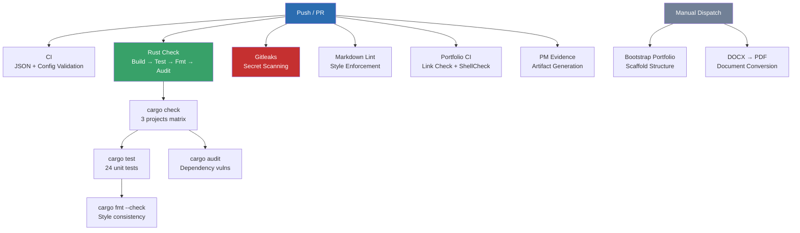

# CI/CD Workflows — Pipeline Documentation

This document describes the purpose and configuration of each GitHub Actions workflow in this repository.

## Workflow Inventory

| Workflow | File | Trigger | Purpose |
|---|---|---|---|
| **CI** | `ci.yml` | push, PR, manual | Validates JSON configs, markdown count, portfolio config integrity |
| **Rust Check** | `rust-check.yml` | push/PR (Rust files), manual | Compiles all 3 Cargo projects, runs 24 unit tests, fmt check, dependency audit |
| **Gitleaks** | `gitleaks.yml` | push, PR | Scans for secrets and credentials in committed files |
| **Markdown Lint** | `markdownlint.yml` | push, PR | Lints all `.md` files against `.markdownlint.json` rules |
| **PM Evidence** | `pm-evidence.yml` | push, manual | Generates project management artifacts (roadmap.json, sessions index) |
| **Portfolio CI** | `portfolio-ci.yml` | push, PR | Validates markdown links and lints shell scripts with ShellCheck |
| **Bootstrap Portfolio** | `bootstrap-portfolio.yml` | push (first), manual | Scaffolds course directory structure from `portfolio/config.json` |
| **DOCX to PDF** | `docx-to-pdf.yml` | manual only | Converts `.docx` files to PDF using LibreOffice |

## Pipeline Architecture

## Security Workflows

### Gitleaks (`gitleaks.yml`)

Scans all committed files for patterns matching API keys, tokens, passwords, and other secrets. Uses the [Gitleaks](https://github.com/gitleaks/gitleaks) tool with the repository's `.gitleaks.toml` configuration.

### Cargo Audit (`rust-check.yml → cargo-audit`)

Checks all Rust dependencies against the [RustSec Advisory Database](https://rustsec.org/) for known vulnerabilities. Currently auditing: `rand` crate (the only external dependency).

## Test Coverage

All 3 Cargo projects are tested in CI:

| Project | Tests | Coverage Focus |
|---|---|---|
| `hangman_v1` | 8 | State transitions, guess processing, display masking |
| `hangman_refined` | 9 | Above + saturating_sub underflow, enum state machine |
| `guessing_game` | 7 | Guess evaluation, boundary conditions, input parsing |
| **Total** | **24** | |

## Adding a New Workflow

1. Create a `.yml` file in `.github/workflows/`
2. Define triggers (`on:` push, PR, manual, schedule)
3. Set appropriate permissions (least privilege)
4. Add concurrency groups to prevent duplicate runs
5. Update this document with the new workflow's purpose
